crime\_rate\_prediction
================
Hao Zheng
12/17/2021

## Data Exploration

### Import the data set

``` r
cdi = read_csv("./data/cdi.csv") %>%
  janitor::clean_names() 
```

    ## Rows: 440 Columns: 17

    ## -- Column specification --------------------------------------------------------
    ## Delimiter: ","
    ## chr  (2): cty, state
    ## dbl (15): id, area, pop, pop18, pop65, docs, beds, crimes, hsgrad, bagrad, p...

    ## 
    ## i Use `spec()` to retrieve the full column specification for this data.
    ## i Specify the column types or set `show_col_types = FALSE` to quiet this message.

``` r
# Create a new variable called crm_1000, which is the crime rate per 1000 population in each county in year 1990, and another variable poparea which is the population density per square mile. Also change the number of doctors and beds into doctors and beds per 1000 population.

cdi = cdi %>% 
  mutate(
    poparea = pop/area,
    crm_1000 = (crimes/pop)*1000,
    docs = (docs/pop) * 1000,
    beds = (beds/pop) * 1000
  )
```

### To preview the data

``` r
glimpse(cdi)
```

    ## Rows: 440
    ## Columns: 19
    ## $ id       <dbl> 1, 2, 3, 4, 5, 6, 7, 8, 9, 10, 11, 12, 13, 14, 15, 16, 17, 18~
    ## $ cty      <chr> "Los_Ange", "Cook", "Harris", "San_Dieg", "Orange", "Kings", ~
    ## $ state    <chr> "CA", "IL", "TX", "CA", "CA", "NY", "AZ", "MI", "FL", "TX", "~
    ## $ area     <dbl> 4060, 946, 1729, 4205, 790, 71, 9204, 614, 1945, 880, 135, 21~
    ## $ pop      <dbl> 8863164, 5105067, 2818199, 2498016, 2410556, 2300664, 2122101~
    ## $ pop18    <dbl> 32.1, 29.2, 31.3, 33.5, 32.6, 28.3, 29.2, 27.4, 27.1, 32.6, 2~
    ## $ pop65    <dbl> 9.7, 12.4, 7.1, 10.9, 9.2, 12.4, 12.5, 12.5, 13.9, 8.2, 15.2,~
    ## $ docs     <dbl> 2.671394, 2.968227, 2.680080, 2.363876, 2.514773, 2.112868, 2~
    ## $ beds     <dbl> 3.125295, 4.221296, 4.417360, 2.473563, 2.642129, 3.886704, 2~
    ## $ crimes   <dbl> 688936, 436936, 253526, 173821, 144524, 680966, 177593, 19397~
    ## $ hsgrad   <dbl> 70.0, 73.4, 74.9, 81.9, 81.2, 63.7, 81.5, 70.0, 65.0, 77.1, 6~
    ## $ bagrad   <dbl> 22.3, 22.8, 25.4, 25.3, 27.8, 16.6, 22.1, 13.7, 18.8, 26.3, 1~
    ## $ poverty  <dbl> 11.6, 11.1, 12.5, 8.1, 5.2, 19.5, 8.8, 16.9, 14.2, 10.4, 16.1~
    ## $ unemp    <dbl> 8.0, 7.2, 5.7, 6.1, 4.8, 9.5, 4.9, 10.0, 8.7, 6.1, 8.0, 4.6, ~
    ## $ pcincome <dbl> 20786, 21729, 19517, 19588, 24400, 16803, 18042, 17461, 17823~
    ## $ totalinc <dbl> 184230, 110928, 55003, 48931, 58818, 38658, 38287, 36872, 345~
    ## $ region   <dbl> 4, 2, 3, 4, 4, 1, 4, 2, 3, 3, 1, 4, 4, 4, 2, 1, 1, 1, 1, 4, 3~
    ## $ poparea  <dbl> 2183.04532, 5396.47674, 1629.95894, 594.05850, 3051.33671, 32~
    ## $ crm_1000 <dbl> 77.73026, 85.58869, 89.96029, 69.58362, 59.95463, 295.98672, ~

``` r
summary(cdi)
```

    ##        id            cty               state                area        
    ##  Min.   :  1.0   Length:440         Length:440         Min.   :   15.0  
    ##  1st Qu.:110.8   Class :character   Class :character   1st Qu.:  451.2  
    ##  Median :220.5   Mode  :character   Mode  :character   Median :  656.5  
    ##  Mean   :220.5                                         Mean   : 1041.4  
    ##  3rd Qu.:330.2                                         3rd Qu.:  946.8  
    ##  Max.   :440.0                                         Max.   :20062.0  
    ##       pop              pop18           pop65             docs        
    ##  Min.   : 100043   Min.   :16.40   Min.   : 3.000   Min.   : 0.3559  
    ##  1st Qu.: 139027   1st Qu.:26.20   1st Qu.: 9.875   1st Qu.: 1.2127  
    ##  Median : 217280   Median :28.10   Median :11.750   Median : 1.7509  
    ##  Mean   : 393011   Mean   :28.57   Mean   :12.170   Mean   : 2.1230  
    ##  3rd Qu.: 436064   3rd Qu.:30.02   3rd Qu.:13.625   3rd Qu.: 2.4915  
    ##  Max.   :8863164   Max.   :49.70   Max.   :33.800   Max.   :17.0377  
    ##       beds             crimes           hsgrad          bagrad     
    ##  Min.   : 0.1649   Min.   :   563   Min.   :46.60   Min.   : 8.10  
    ##  1st Qu.: 2.1972   1st Qu.:  6220   1st Qu.:73.88   1st Qu.:15.28  
    ##  Median : 3.3287   Median : 11820   Median :77.70   Median :19.70  
    ##  Mean   : 3.6493   Mean   : 27112   Mean   :77.56   Mean   :21.08  
    ##  3rd Qu.: 4.5649   3rd Qu.: 26280   3rd Qu.:82.40   3rd Qu.:25.32  
    ##  Max.   :19.6982   Max.   :688936   Max.   :92.90   Max.   :52.30  
    ##     poverty           unemp           pcincome        totalinc     
    ##  Min.   : 1.400   Min.   : 2.200   Min.   : 8899   Min.   :  1141  
    ##  1st Qu.: 5.300   1st Qu.: 5.100   1st Qu.:16118   1st Qu.:  2311  
    ##  Median : 7.900   Median : 6.200   Median :17759   Median :  3857  
    ##  Mean   : 8.721   Mean   : 6.597   Mean   :18561   Mean   :  7869  
    ##  3rd Qu.:10.900   3rd Qu.: 7.500   3rd Qu.:20270   3rd Qu.:  8654  
    ##  Max.   :36.300   Max.   :21.300   Max.   :37541   Max.   :184230  
    ##      region         poparea            crm_1000      
    ##  Min.   :1.000   Min.   :   13.26   Min.   :  4.601  
    ##  1st Qu.:2.000   1st Qu.:  192.34   1st Qu.: 38.102  
    ##  Median :3.000   Median :  335.91   Median : 52.429  
    ##  Mean   :2.461   Mean   :  888.44   Mean   : 57.286  
    ##  3rd Qu.:3.000   3rd Qu.:  756.55   3rd Qu.: 72.597  
    ##  Max.   :4.000   Max.   :32403.72   Max.   :295.987

## Draw pairwise plot to check association betwee every two variable

``` r
ggpairs(cdi[,-c(1,2,3,10)])
```

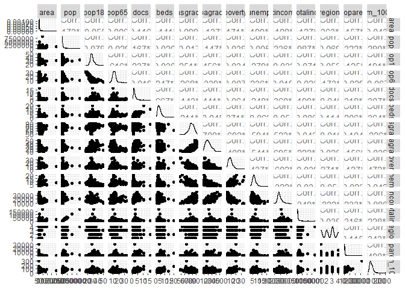<!-- -->

From the pairwise plot, we observed the correlation and distribution
between every two variables. The association between crime rate to each
variable was displayed in the last row. No strong linear relationship
was detected between the crime rate per 1000 person and other variables.
Between variables, we noticed that Percent of population aged 18-34 have
negative relation with Percent of population aged 65+. Although the high
absolute value of correlation indicates a strong relationship, it may
not be linear relation.

### Take a look of variables with high correlations

``` r
totalinc_pop = ggplot(cdi, aes(x = totalinc, y = pop)) +
      geom_point() +
      theme(legend.position = "none")
ggMarginal(totalinc_pop, type = "density")


#not ob linear
pop18_pop65 = ggplot(cdi, aes(x = pop18, y = pop65)) + geom_point() +
      theme(legend.position = "none")
ggMarginal(pop18_pop65, type = "density")

#not ob linear
hsgrad_bagrad = ggplot(cdi, aes(x = hsgrad, y = bagrad)) + geom_point() +
      theme(legend.position = "none")
ggMarginal(hsgrad_bagrad , type = "density")


hsgrad_poverty = ggplot(cdi, aes(x = hsgrad, y = poverty)) + geom_point() +
      theme(legend.position = "none")
ggMarginal(hsgrad_poverty, type = "density")


hsgrad_unemp = ggplot(cdi, aes(x = hsgrad, y = unemp)) + geom_point() +
      theme(legend.position = "none")
ggMarginal(hsgrad_unemp , type = "density")


hsgrad_pcincome = ggplot(cdi, aes(x = hsgrad, y = pcincome)) + geom_point() +
      theme(legend.position = "none")
ggMarginal(hsgrad_pcincome, type = "density")

bagrad_pcincome = ggplot(cdi, aes(x = bagrad, y = pcincome)) + geom_point() +
      theme(legend.position = "none")
ggMarginal(bagrad_pcincome, type = "density")


bagrad_unemp = ggplot(cdi, aes(x = bagrad, y = unemp)) + geom_point() +
      theme(legend.position = "none")
ggMarginal(bagrad_unemp, type = "density")


bagrad_poverty = ggplot(cdi, aes(x = bagrad, y = poverty)) + geom_point() +
      theme(legend.position = "none")
ggMarginal(bagrad_poverty, type = "density")
```

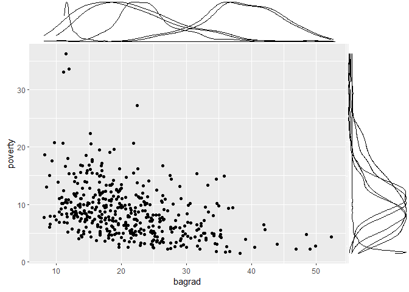<!-- -->

### Crime Rate Comparison Across Region

``` r
#CRM_1000 vs. Geographic Region
cdi_region = cdi %>%
  group_by(region) %>%
  summarise(region_crm_1000 = sum(crimes)*1000/sum(pop)) %>%
  arrange(desc(region_crm_1000))

cdi_region = cdi_region %>%
  mutate(region_cla = case_when(
  region == 1 ~ "Northeast",
  region == 2 ~ "North Central",
  region == 3 ~ "South",
  region == 4 ~ "West")) %>% 
  mutate(region_cla = as.factor(region_cla)) %>% 
  arrange(region_cla,region_crm_1000)

ggplot(cdi_region) + 
  geom_bar(stat = "identity",aes( y = region_crm_1000,reorder(region_cla,+region_crm_1000)),fill = "darkblue",width = 0.3) +
  labs(x = "Region", y = "Crime Rate",title = "The Crime Rate of Each Geographic Region") +
  theme(plot.title = element_text(hjust = 0.5))
```

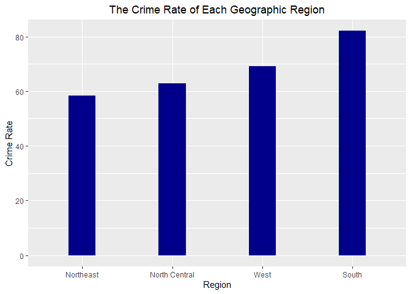<!-- -->

Southern US have highest crime rate.

### State crime( find the state with unusual crime rate)

``` r
#CRM_1000 vs. state
cdi_state = cdi %>%
  group_by(state) %>%
  summarise(state_crm_1000 = sum(crimes)*1000/sum(pop)) %>%
  arrange(desc(state_crm_1000))

theme_dotplot <- theme_bw(10) +
    theme(axis.text.y = element_text(size = rel(0.75)),
        axis.ticks.y = element_blank(),
        axis.title.x = element_text(size = rel(0.75)),
        panel.grid.major.x = element_blank(),
        panel.grid.major.y = element_line(size = 0.5),
        panel.grid.minor.x = element_blank())

ggplot(cdi_state,aes(state_crm_1000,reorder(state,state_crm_1000))) +
  geom_point(color = "blue") +
  scale_x_continuous(limits = c(30, 110),breaks = seq(30,110,5)) + 
  theme_dotplot +
  labs(y = "State",title = 
         "The Crime Rate with different States") +
  theme(plot.title = element_text(hjust = 0.5))
```

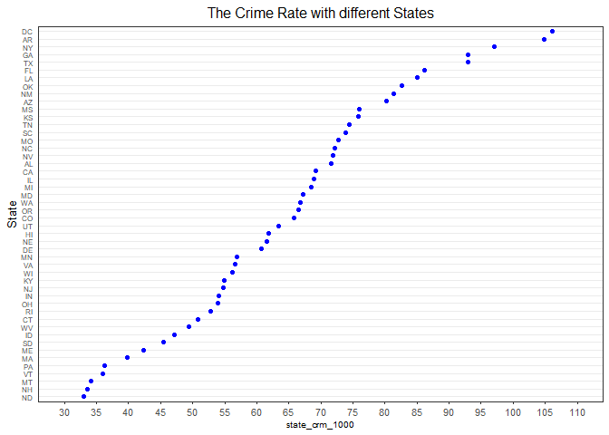<!-- -->

``` r
ggplot(cdi_state,aes(y = state_crm_1000)) + geom_boxplot()
```

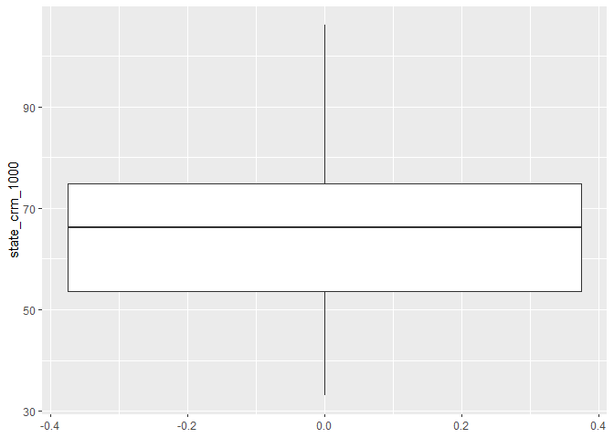<!-- -->

According to the boxplot, there is no outliers, which means there is no
states with unusual crime rate.

``` r
cdi_desc = cdi %>%
  arrange(desc(crm_1000))
head(cdi_desc)
```

    ## # A tibble: 6 x 19
    ##      id cty      state  area     pop pop18 pop65  docs  beds crimes hsgrad bagrad
    ##   <dbl> <chr>    <chr> <dbl>   <dbl> <dbl> <dbl> <dbl> <dbl>  <dbl>  <dbl>  <dbl>
    ## 1     6 Kings    NY       71 2300664  28.3  12.4  2.11  3.89 680966   63.7   16.6
    ## 2   123 St._Loui MO       62  396685  28.7  16.6 10.6  19.7   64103   62.8   15.3
    ## 3    70 Fulton   GA      529  648951  31.6  10    5.19  8.87  93025   77.8   31.6
    ## 4     9 Dade     FL     1945 1937094  27.1  13.9  3.24  4.56 244725   65     18.8
    ## 5   374 Ector    TX      901  118934  27.1   9.3  1.29  3.27  14643   66.9   11.4
    ## 6   239 Leon     FL      667  192493  38.5   8.2  2.15  4.28  23363   84.9   37.1
    ## # ... with 7 more variables: poverty <dbl>, unemp <dbl>, pcincome <dbl>,
    ## #   totalinc <dbl>, region <dbl>, poparea <dbl>, crm_1000 <dbl>

``` r
ggplot(cdi_desc,aes(y = crm_1000)) + geom_boxplot()
```

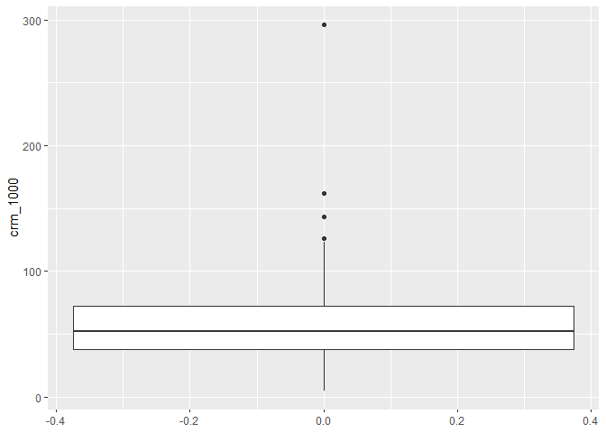<!-- -->

There are four county with unusual crime rate, and they are (Kings, NY),
(123 St.\_Loui, MO),(70, Fulton, GA), (9 Dade, FL)

## Multiple Linear Regression Model Construction

``` r
cdi = 
  cdi %>% 
  mutate(
    region = as.factor(region)
  ) %>% 
  dplyr::select(-id,-cty,-state,-crimes)
```

### Model 1: Full model

Let’s first fit the model with all the predictors:

``` r
model1 = lm(crm_1000 ~ ., data = cdi)

broom::tidy(model1) %>% 
  knitr::kable()
```

| term        |    estimate |  std.error |  statistic |   p.value |
|:------------|------------:|-----------:|-----------:|----------:|
| (Intercept) | -95.5189646 | 26.6636149 | -3.5823711 | 0.0003801 |
| area        |  -0.0003144 |  0.0006703 | -0.4690426 | 0.6392809 |
| pop         |   0.0000812 |  0.0000127 |  6.4106097 | 0.0000000 |
| pop18       |   0.8704346 |  0.3191779 |  2.7271140 | 0.0066549 |
| pop65       |  -0.0580139 |  0.2952493 | -0.1964914 | 0.8443200 |
| docs        |  -0.4149594 |  0.9805516 | -0.4231898 | 0.6723719 |
| beds        |   2.7526148 |  0.7668761 |  3.5893864 | 0.0003703 |
| hsgrad      |   0.5090193 |  0.2591722 |  1.9640197 | 0.0501822 |
| bagrad      |  -0.5422934 |  0.2855774 | -1.8989367 | 0.0582530 |
| poverty     |   1.9594621 |  0.3721326 |  5.2654943 | 0.0000002 |
| unemp       |   0.4436160 |  0.5117840 |  0.8668031 | 0.3865413 |
| pcincome    |   0.0026666 |  0.0005272 |  5.0584493 | 0.0000006 |
| totalinc    |  -0.0036681 |  0.0006068 | -6.0449586 | 0.0000000 |
| region2     |   9.3014507 |  2.6258092 |  3.5423178 | 0.0004408 |
| region3     |  27.2932342 |  2.5581241 | 10.6692379 | 0.0000000 |
| region4     |  21.3813487 |  3.2291786 |  6.6212965 | 0.0000000 |
| poparea     |   0.0042337 |  0.0004608 |  9.1868758 | 0.0000000 |

We can see that the variables `area`, `pop65`, `docs`, `bagrad`, `unemp`
are all not very significant with a p-value larger than 0.05.

### Model 2: Model found by looking at correlation clusters

Then, plot a heatmap for the correlations among all the variables.

``` r
res = cor(cdi %>% dplyr::select(-region))
round(res, 2) %>%
  knitr::kable()
```

|           |  area |   pop | pop18 | pop65 |  docs |  beds | hsgrad | bagrad | poverty | unemp | pcincome | totalinc | poparea | crm\_1000 |
|:----------|------:|------:|------:|------:|------:|------:|-------:|-------:|--------:|------:|---------:|---------:|--------:|----------:|
| area      |  1.00 |  0.17 | -0.05 |  0.01 | -0.12 | -0.14 |  -0.10 |  -0.14 |    0.17 |  0.20 |    -0.19 |     0.13 |   -0.16 |      0.04 |
| pop       |  0.17 |  1.00 |  0.08 | -0.03 |  0.17 |  0.02 |  -0.02 |   0.15 |    0.04 |  0.01 |     0.24 |     0.99 |    0.32 |      0.28 |
| pop18     | -0.05 |  0.08 |  1.00 | -0.62 |  0.24 |  0.03 |   0.25 |   0.46 |    0.03 | -0.28 |    -0.03 |     0.07 |    0.13 |      0.19 |
| pop65     |  0.01 | -0.03 | -0.62 |  1.00 |  0.02 |  0.25 |  -0.27 |  -0.34 |    0.01 |  0.24 |     0.02 |    -0.02 |    0.03 |     -0.07 |
| docs      | -0.12 |  0.17 |  0.24 |  0.02 |  1.00 |  0.67 |   0.14 |   0.44 |    0.06 | -0.25 |     0.36 |     0.20 |    0.32 |      0.31 |
| beds      | -0.14 |  0.02 |  0.03 |  0.25 |  0.67 |  1.00 |  -0.21 |  -0.05 |    0.37 | -0.06 |    -0.05 |     0.01 |    0.21 |      0.36 |
| hsgrad    | -0.10 | -0.02 |  0.25 | -0.27 |  0.14 | -0.21 |   1.00 |   0.71 |   -0.69 | -0.59 |     0.52 |     0.04 |   -0.10 |     -0.23 |
| bagrad    | -0.14 |  0.15 |  0.46 | -0.34 |  0.44 | -0.05 |   0.71 |   1.00 |   -0.41 | -0.54 |     0.70 |     0.22 |    0.16 |      0.04 |
| poverty   |  0.17 |  0.04 |  0.03 |  0.01 |  0.06 |  0.37 |  -0.69 |  -0.41 |    1.00 |  0.44 |    -0.60 |    -0.04 |    0.13 |      0.47 |
| unemp     |  0.20 |  0.01 | -0.28 |  0.24 | -0.25 | -0.06 |  -0.59 |  -0.54 |    0.44 |  1.00 |    -0.32 |    -0.03 |    0.02 |      0.04 |
| pcincome  | -0.19 |  0.24 | -0.03 |  0.02 |  0.36 | -0.05 |   0.52 |   0.70 |   -0.60 | -0.32 |     1.00 |     0.35 |    0.23 |     -0.08 |
| totalinc  |  0.13 |  0.99 |  0.07 | -0.02 |  0.20 |  0.01 |   0.04 |   0.22 |   -0.04 | -0.03 |     0.35 |     1.00 |    0.32 |      0.23 |
| poparea   | -0.16 |  0.32 |  0.13 |  0.03 |  0.32 |  0.21 |  -0.10 |   0.16 |    0.13 |  0.02 |     0.23 |     0.32 |    1.00 |      0.48 |
| crm\_1000 |  0.04 |  0.28 |  0.19 | -0.07 |  0.31 |  0.36 |  -0.23 |   0.04 |    0.47 |  0.04 |    -0.08 |     0.23 |    0.48 |      1.00 |

``` r
col <- colorRampPalette(c("blue", "white", "red"))(20)
heatmap(x = res, col = col, symm = TRUE)
```

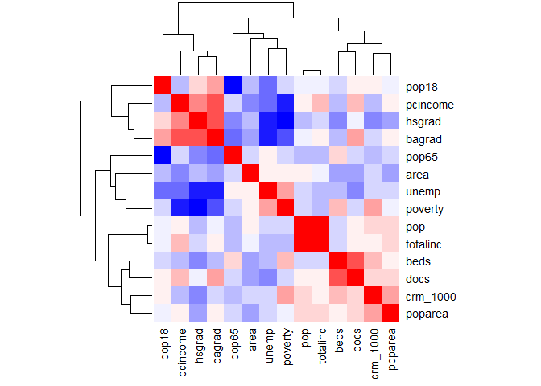<!-- -->

According to the clusters generated by R, we then choose variables that
are not highly related with each other and are highly related to the
outcome `crm_1000`.

``` r
model2 = lm(crm_1000 ~ pop18 + pcincome + hsgrad + pop65 + poverty + beds + poparea + region, data = cdi)

broom::tidy(model2) %>% 
  knitr::kable()
```

| term        |    estimate |  std.error |  statistic |   p.value |
|:------------|------------:|-----------:|-----------:|----------:|
| (Intercept) | -23.6681871 | 19.4889031 | -1.2144443 | 0.2252462 |
| pop18       |   0.4635470 |  0.2890869 |  1.6034866 | 0.1095632 |
| pcincome    |   0.0006934 |  0.0003131 |  2.2147905 | 0.0272992 |
| hsgrad      |   0.1432941 |  0.2092863 |  0.6846795 | 0.4939159 |
| pop65       |  -0.1037995 |  0.3079349 | -0.3370825 | 0.7362195 |
| poverty     |   1.8043209 |  0.3444210 |  5.2387073 | 0.0000003 |
| beds        |   2.5129533 |  0.5467889 |  4.5958385 | 0.0000057 |
| poparea     |   0.0051797 |  0.0004486 | 11.5462151 | 0.0000000 |
| region2     |  10.3028384 |  2.7239226 |  3.7823536 | 0.0001774 |
| region3     |  26.1491461 |  2.5354946 | 10.3132330 | 0.0000000 |
| region4     |  22.4005096 |  3.0880693 |  7.2538883 | 0.0000000 |

### Model 3: Step-wise model based on model 2

Conduct the automatic step-wise process on the predictors used in model
2.

``` r
mult.fit = lm(crm_1000 ~ pop18 + pcincome + hsgrad + pop65 + poverty + beds + poparea + region, data = cdi)
step(mult.fit, direction = "both")
```

    ## Start:  AIC=2559.62
    ## crm_1000 ~ pop18 + pcincome + hsgrad + pop65 + poverty + beds + 
    ##     poparea + region
    ## 
    ##            Df Sum of Sq    RSS    AIC
    ## - pop65     1        37 140695 2557.7
    ## - hsgrad    1       154 140811 2558.1
    ## <none>                  140658 2559.6
    ## - pop18     1       843 141501 2560.2
    ## - pcincome  1      1608 142266 2562.6
    ## - beds      1      6925 147583 2578.8
    ## - poverty   1      8998 149656 2584.9
    ## - region    3     39727 180384 2663.1
    ## - poparea   1     43710 184368 2676.7
    ## 
    ## Step:  AIC=2557.73
    ## crm_1000 ~ pop18 + pcincome + hsgrad + poverty + beds + poparea + 
    ##     region
    ## 
    ##            Df Sum of Sq    RSS    AIC
    ## - hsgrad    1       177 140872 2556.3
    ## <none>                  140695 2557.7
    ## + pop65     1        37 140658 2559.6
    ## - pop18     1      1638 142333 2560.8
    ## - pcincome  1      1667 142362 2560.9
    ## - beds      1      7553 148248 2578.7
    ## - poverty   1      9579 150273 2584.7
    ## - region    3     39987 180682 2661.8
    ## - poparea   1     43746 184440 2674.8
    ## 
    ## Step:  AIC=2556.29
    ## crm_1000 ~ pop18 + pcincome + poverty + beds + poparea + region
    ## 
    ##            Df Sum of Sq    RSS    AIC
    ## <none>                  140872 2556.3
    ## + hsgrad    1       177 140695 2557.7
    ## + pop65     1        61 140811 2558.1
    ## - pcincome  1      2150 143022 2560.9
    ## - pop18     1      2633 143505 2562.4
    ## - beds      1      7827 148699 2578.1
    ## - poverty   1     11675 152547 2589.3
    ## - region    3     41931 182803 2664.9
    ## - poparea   1     43963 184835 2673.8

    ## 
    ## Call:
    ## lm(formula = crm_1000 ~ pop18 + pcincome + poverty + beds + poparea + 
    ##     region, data = cdi)
    ## 
    ## Coefficients:
    ## (Intercept)        pop18     pcincome      poverty         beds      poparea  
    ##  -1.823e+01    5.955e-01    7.669e-04    1.691e+00    2.480e+00    5.117e-03  
    ##     region2      region3      region4  
    ##   1.099e+01    2.648e+01    2.330e+01

``` r
# Obtain a new model 3
model3 = lm(crm_1000 ~ pop18 + pcincome + poverty + beds + poparea + region, data = cdi)

broom::tidy(model3) %>% 
  knitr::kable()
```

| term        |    estimate | std.error | statistic |   p.value |
|:------------|------------:|----------:|----------:|----------:|
| (Intercept) | -18.2293958 | 9.5192418 | -1.915005 | 0.0561535 |
| pop18       |   0.5954624 | 0.2097831 |  2.838467 | 0.0047473 |
| pcincome    |   0.0007669 | 0.0002990 |  2.564681 | 0.0106647 |
| poverty     |   1.6914100 | 0.2829998 |  5.976718 | 0.0000000 |
| beds        |   2.4799771 | 0.5067843 |  4.893555 | 0.0000014 |
| poparea     |   0.0051174 | 0.0004412 | 11.597621 | 0.0000000 |
| region2     |  10.9946235 | 2.5734568 |  4.272317 | 0.0000238 |
| region3     |  26.4793530 | 2.4966602 | 10.605910 | 0.0000000 |
| region4     |  23.2995439 | 2.8713894 |  8.114380 | 0.0000000 |

Model 3 is rather good, and with a smaller number of predictors.

Then we need to see the residual plot for model 3 in order to get some
insight of some potential transformation.

``` r
cdi %>% 
  add_predictions(model3) %>% 
  add_residuals(model3) %>% 
  ggplot(aes(x = pred, y = resid)) +
  geom_point(alpha = 0.4) + 
  geom_smooth(se = F, color = "red", method = "lm") +
  labs(title = "Risidual Plot for model 3",
       x = "Fitted Value", 
       y = "Residual")
```

    ## `geom_smooth()` using formula 'y ~ x'

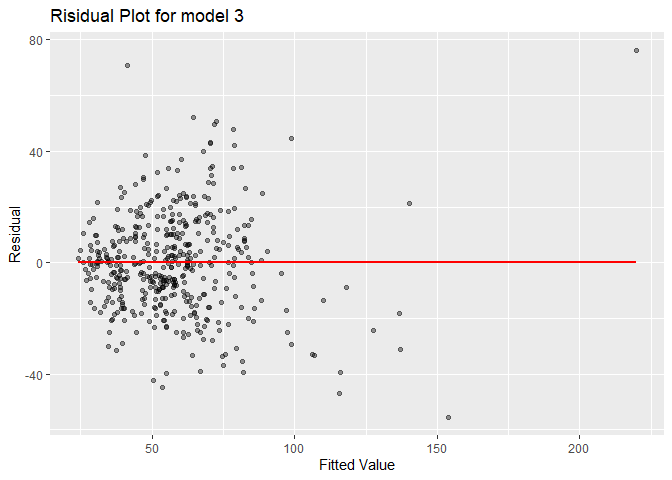<!-- -->

The residuals are randomly scattered so we may suppose that linearity
has already been achieved.

### Model 4: Try to add interaction terms in model 3

We can then consider adding some potential interaction terms to model 3.
So what interaction terms can we add?

We suppose the terms that both have significant main effect on the
outcomes may interact together on the outcomes, so we add the pairwise
interactions of `poparea`, `poverty`, `region` and `beds` into model 3.
Next, Apply step-wise process on it to come up with a new model.

``` r
mult.fit = lm(crm_1000 ~ pop18 + pcincome + poverty + beds + poparea + region + poparea*poverty + poparea*region + poverty*region + beds*poparea + beds*region + beds*poverty, data = cdi)
step(mult.fit, direction = "both")
```

    ## Start:  AIC=2522.11
    ## crm_1000 ~ pop18 + pcincome + poverty + beds + poparea + region + 
    ##     poparea * poverty + poparea * region + poverty * region + 
    ##     beds * poparea + beds * region + beds * poverty
    ## 
    ##                   Df Sum of Sq    RSS    AIC
    ## - beds:region      3     494.8 123919 2517.9
    ## - poverty:beds     1      44.8 123469 2520.3
    ## - poverty:region   3    1479.0 124904 2521.3
    ## - poparea:region   3    1503.3 124928 2521.4
    ## <none>                         123424 2522.1
    ## - beds:poparea     1    1230.0 124654 2524.5
    ## - pop18            1    5323.5 128748 2538.7
    ## - pcincome         1    6101.1 129526 2541.3
    ## - poverty:poparea  1    6572.5 129997 2542.9
    ## 
    ## Step:  AIC=2517.87
    ## crm_1000 ~ pop18 + pcincome + poverty + beds + poparea + region + 
    ##     poverty:poparea + poparea:region + poverty:region + beds:poparea + 
    ##     poverty:beds
    ## 
    ##                   Df Sum of Sq    RSS    AIC
    ## - poverty:beds     1      13.7 123933 2515.9
    ## - poverty:region   3    1467.0 125386 2517.1
    ## - poparea:region   3    1544.3 125464 2517.3
    ## <none>                         123919 2517.9
    ## - beds:poparea     1    1622.6 125542 2521.6
    ## + beds:region      3     494.8 123424 2522.1
    ## - pop18            1    5363.0 129282 2534.5
    ## - pcincome         1    6003.7 129923 2536.7
    ## - poverty:poparea  1    6656.2 130576 2538.9
    ## 
    ## Step:  AIC=2515.92
    ## crm_1000 ~ pop18 + pcincome + poverty + beds + poparea + region + 
    ##     poverty:poparea + poparea:region + poverty:region + beds:poparea
    ## 
    ##                   Df Sum of Sq    RSS    AIC
    ## - poverty:region   3    1477.5 125411 2515.1
    ## - poparea:region   3    1542.0 125475 2515.4
    ## <none>                         123933 2515.9
    ## + poverty:beds     1      13.7 123919 2517.9
    ## + beds:region      3     463.7 123469 2520.3
    ## - beds:poparea     1    2661.5 126594 2523.3
    ## - pop18            1    5364.6 129298 2532.6
    ## - pcincome         1    6115.2 130048 2535.1
    ## - poverty:poparea  1    7232.6 131166 2538.9
    ## 
    ## Step:  AIC=2515.13
    ## crm_1000 ~ pop18 + pcincome + poverty + beds + poparea + region + 
    ##     poverty:poparea + poparea:region + beds:poparea
    ## 
    ##                   Df Sum of Sq    RSS    AIC
    ## <none>                         125411 2515.1
    ## + poverty:region   3    1477.5 123933 2515.9
    ## + poverty:beds     1      24.2 125386 2517.1
    ## - poparea:region   3    2658.5 128069 2518.4
    ## + beds:region      3     480.8 124930 2519.4
    ## - beds:poparea     1    2413.5 127824 2521.5
    ## - pop18            1    5063.1 130474 2530.6
    ## - pcincome         1    6335.9 131746 2534.8
    ## - poverty:poparea  1    7067.1 132478 2537.2

    ## 
    ## Call:
    ## lm(formula = crm_1000 ~ pop18 + pcincome + poverty + beds + poparea + 
    ##     region + poverty:poparea + poparea:region + beds:poparea, 
    ##     data = cdi)
    ## 
    ## Coefficients:
    ##     (Intercept)            pop18         pcincome          poverty  
    ##      -3.755e+01        8.416e-01        1.471e-03        1.586e+00  
    ##            beds          poparea          region2          region3  
    ##       3.118e+00       -4.149e-04        7.591e+00        2.754e+01  
    ##         region4  poverty:poparea  poparea:region2  poparea:region3  
    ##       2.468e+01        4.929e-04        4.945e-03       -4.732e-04  
    ## poparea:region4     beds:poparea  
    ##      -9.677e-04       -5.161e-04

``` r
model4 = lm(crm_1000 ~ pop18 + pcincome + poverty + beds + poparea + region + poparea*region + poparea*poverty + poparea*beds, data = cdi)

broom::tidy(model4) %>% 
  knitr::kable()
```

| term            |    estimate | std.error |  statistic |   p.value |
|:----------------|------------:|----------:|-----------:|----------:|
| (Intercept)     | -37.5488169 | 9.6968176 | -3.8722825 | 0.0001248 |
| pop18           |   0.8415873 | 0.2029341 |  4.1470967 | 0.0000407 |
| pcincome        |   0.0014707 | 0.0003170 |  4.6392019 | 0.0000047 |
| poverty         |   1.5858679 | 0.2709116 |  5.8538209 | 0.0000000 |
| beds            |   3.1175379 | 0.5576291 |  5.5907014 | 0.0000000 |
| poparea         |  -0.0004149 | 0.0019254 | -0.2154843 | 0.8294929 |
| region2         |   7.5908714 | 2.8938734 |  2.6230834 | 0.0090264 |
| region3         |  27.5420151 | 2.6753565 | 10.2947086 | 0.0000000 |
| region4         |  24.6767136 | 2.9702723 |  8.3078961 | 0.0000000 |
| poparea:region2 |   0.0049452 | 0.0019081 |  2.5916330 | 0.0098803 |
| poparea:region3 |  -0.0004732 | 0.0012779 | -0.3702908 | 0.7113499 |
| poparea:region4 |  -0.0009677 | 0.0013935 | -0.6944421 | 0.4877835 |
| poverty:poparea |   0.0004929 | 0.0001006 |  4.8995814 | 0.0000014 |
| beds:poparea    |  -0.0005161 | 0.0001802 | -2.8632393 | 0.0044004 |

### Model 5 & 6: Model based on internet searching result

In addition, we can try to find other models based on the searching
results of the potentially related factors of crime rates: age, medical
resources, educational level, poverty, unemployment rate, personal
income and population density per square mile.

``` r
model5 = lm(crm_1000 ~ pop18 + beds + hsgrad + poverty + unemp + pcincome + poparea, data = cdi)

broom::tidy(model5) %>% 
  knitr::kable()
```

| term        |    estimate |  std.error | statistic |   p.value |
|:------------|------------:|-----------:|----------:|----------:|
| (Intercept) | -22.6348024 | 20.6352727 | -1.096899 | 0.2732968 |
| pop18       |   0.5136253 |  0.2615950 |  1.963437 | 0.0502364 |
| beds        |   1.3959722 |  0.5617699 |  2.484954 | 0.0133344 |
| hsgrad      |   0.3162693 |  0.2310961 |  1.368562 | 0.1718476 |
| poverty     |   3.1510026 |  0.3572178 |  8.820955 | 0.0000000 |
| unemp       |  -1.1140543 |  0.5478396 | -2.033541 | 0.0426086 |
| pcincome    |   0.0006137 |  0.0003425 |  1.791894 | 0.0738497 |
| poparea     |   0.0046179 |  0.0004994 |  9.247351 | 0.0000000 |

Then we use step-wise process based on the predictors used in model 5.

``` r
mult.fit = lm(crm_1000 ~ pop18 + beds + hsgrad + poverty + unemp + pcincome + poparea, data = cdi)
step(mult.fit, direction = "both")
```

    ## Start:  AIC=2659.6
    ## crm_1000 ~ pop18 + beds + hsgrad + poverty + unemp + pcincome + 
    ##     poparea
    ## 
    ##            Df Sum of Sq    RSS    AIC
    ## - hsgrad    1       776 179745 2659.5
    ## <none>                  178969 2659.6
    ## - pcincome  1      1330 180299 2660.9
    ## - pop18     1      1597 180566 2661.5
    ## - unemp     1      1713 180682 2661.8
    ## - beds      1      2558 181527 2663.8
    ## - poverty   1     32235 211203 2730.5
    ## - poparea   1     35426 214395 2737.1
    ## 
    ## Step:  AIC=2659.51
    ## crm_1000 ~ pop18 + beds + poverty + unemp + pcincome + poparea
    ## 
    ##            Df Sum of Sq    RSS    AIC
    ## <none>                  179745 2659.5
    ## + hsgrad    1       776 178969 2659.6
    ## - pcincome  1      1995 181739 2662.4
    ## - beds      1      2382 182126 2663.3
    ## - pop18     1      2591 182336 2663.8
    ## - unemp     1      3059 182803 2664.9
    ## - poverty   1     33862 213606 2733.4
    ## - poparea   1     34659 214403 2735.1

    ## 
    ## Call:
    ## lm(formula = crm_1000 ~ pop18 + beds + poverty + unemp + pcincome + 
    ##     poparea, data = cdi)
    ## 
    ## Coefficients:
    ## (Intercept)        pop18         beds      poverty        unemp     pcincome  
    ##   0.4516689    0.6229671    1.3439240    2.9531064   -1.3866805    0.0007286  
    ##     poparea  
    ##   0.0045065

``` r
model6 = lm(crm_1000 ~ pop18 + beds + poverty + unemp + pcincome + poparea, data = cdi)

broom::tidy(model6) %>% 
  knitr::kable()
```

| term        |   estimate |  std.error | statistic |   p.value |
|:------------|-----------:|-----------:|----------:|----------:|
| (Intercept) |  0.4516689 | 11.8966833 |  0.037966 | 0.9697323 |
| pop18       |  0.6229671 |  0.2493467 |  2.498397 | 0.0128454 |
| beds        |  1.3439240 |  0.5610458 |  2.395391 | 0.0170265 |
| poverty     |  2.9531064 |  0.3269711 |  9.031706 | 0.0000000 |
| unemp       | -1.3866805 |  0.5108523 | -2.714445 | 0.0069039 |
| pcincome    |  0.0007286 |  0.0003324 |  2.192205 | 0.0288964 |
| poparea     |  0.0045065 |  0.0004932 |  9.137395 | 0.0000000 |

Draw the residual plots:

``` r
res5 = 
  cdi %>% 
  add_predictions(model5) %>% 
  add_residuals(model5) %>% 
  ggplot(aes(x = pred, y = resid)) +
  geom_point(alpha = 0.4) + 
  geom_smooth(se = F, color = "red", method = "lm") +
  labs(title = "Risidual Plot for model 5",
       x = "Fitted Value", 
       y = "Residual")

res6 = 
  cdi %>% 
  add_predictions(model6) %>% 
  add_residuals(model6) %>% 
  ggplot(aes(x = pred, y = resid)) +
  geom_point(alpha = 0.4) + 
  geom_smooth(se = F, color = "red", method = "lm") +
  labs(title = "Risidual Plot for model 6",
       x = "Fitted Value", 
       y = "Residual")

res5 + res6
```

    ## `geom_smooth()` using formula 'y ~ x'
    ## `geom_smooth()` using formula 'y ~ x'

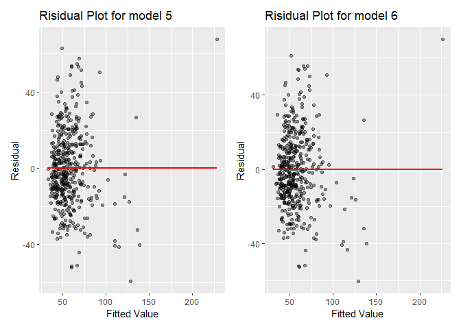<!-- -->

By the residual plot for the above two models, we cannot see a big
difference.

### Model 7: Step-wise model generated with all the variables

``` r
# Use step-wise regression to try to find a mlr model
mult.fit = lm(crm_1000 ~ ., data = cdi)
step(mult.fit, direction = "both")
```

    ## Start:  AIC=2515.41
    ## crm_1000 ~ area + pop + pop18 + pop65 + docs + beds + hsgrad + 
    ##     bagrad + poverty + unemp + pcincome + totalinc + region + 
    ##     poparea
    ## 
    ##            Df Sum of Sq    RSS    AIC
    ## - pop65     1        11 123801 2513.4
    ## - docs      1        52 123843 2513.6
    ## - area      1        64 123854 2513.6
    ## - unemp     1       220 124010 2514.2
    ## <none>                  123790 2515.4
    ## - bagrad    1      1055 124845 2517.1
    ## - hsgrad    1      1129 124919 2517.4
    ## - pop18     1      2176 125967 2521.1
    ## - beds      1      3770 127560 2526.6
    ## - pcincome  1      7488 131278 2539.2
    ## - poverty   1      8114 131904 2541.3
    ## - totalinc  1     10694 134484 2549.9
    ## - pop       1     12027 135817 2554.2
    ## - poparea   1     24699 148489 2593.5
    ## - region    3     37378 161168 2625.5
    ## 
    ## Step:  AIC=2513.45
    ## crm_1000 ~ area + pop + pop18 + docs + beds + hsgrad + bagrad + 
    ##     poverty + unemp + pcincome + totalinc + region + poparea
    ## 
    ##            Df Sum of Sq    RSS    AIC
    ## - docs      1        51 123853 2511.6
    ## - area      1        69 123871 2511.7
    ## - unemp     1       211 124012 2512.2
    ## <none>                  123801 2513.4
    ## - bagrad    1      1057 124858 2515.2
    ## + pop65     1        11 123790 2515.4
    ## - hsgrad    1      1143 124945 2515.5
    ## - pop18     1      3134 126935 2522.4
    ## - beds      1      3993 127795 2525.4
    ## - pcincome  1      7618 131419 2537.7
    ## - poverty   1      8607 132408 2541.0
    ## - totalinc  1     10842 134643 2548.4
    ## - pop       1     12180 135981 2552.7
    ## - poparea   1     24841 148642 2591.9
    ## - region    3     37399 161200 2623.6
    ## 
    ## Step:  AIC=2511.63
    ## crm_1000 ~ area + pop + pop18 + beds + hsgrad + bagrad + poverty + 
    ##     unemp + pcincome + totalinc + region + poparea
    ## 
    ##            Df Sum of Sq    RSS    AIC
    ## - area      1        72 123925 2509.9
    ## - unemp     1       207 124060 2510.4
    ## <none>                  123853 2511.6
    ## + docs      1        51 123801 2513.4
    ## + pop65     1        10 123843 2513.6
    ## - hsgrad    1      1188 125041 2513.8
    ## - bagrad    1      1253 125105 2514.1
    ## - pop18     1      3084 126937 2520.4
    ## - beds      1      7105 130957 2534.2
    ## - pcincome  1      7567 131420 2535.7
    ## - poverty   1      8679 132531 2539.4
    ## - totalinc  1     10924 134776 2546.8
    ## - pop       1     12259 136112 2551.2
    ## - poparea   1     24888 148741 2590.2
    ## - region    3     37348 161201 2621.6
    ## 
    ## Step:  AIC=2509.89
    ## crm_1000 ~ pop + pop18 + beds + hsgrad + bagrad + poverty + unemp + 
    ##     pcincome + totalinc + region + poparea
    ## 
    ##            Df Sum of Sq    RSS    AIC
    ## - unemp     1       196 124120 2508.6
    ## <none>                  123925 2509.9
    ## + area      1        72 123853 2511.6
    ## + docs      1        54 123871 2511.7
    ## + pop65     1        15 123910 2511.8
    ## - hsgrad    1      1219 125144 2512.2
    ## - bagrad    1      1253 125178 2512.3
    ## - pop18     1      3072 126996 2518.7
    ## - beds      1      7166 131091 2532.6
    ## - pcincome  1      7507 131431 2533.8
    ## - poverty   1      8630 132554 2537.5
    ## - totalinc  1     11073 134998 2545.6
    ## - pop       1     12545 136470 2550.3
    ## - poparea   1     26974 150899 2594.5
    ## - region    3     37292 161217 2619.6
    ## 
    ## Step:  AIC=2508.58
    ## crm_1000 ~ pop + pop18 + beds + hsgrad + bagrad + poverty + pcincome + 
    ##     totalinc + region + poparea
    ## 
    ##            Df Sum of Sq    RSS    AIC
    ## <none>                  124120 2508.6
    ## + unemp     1       196 123925 2509.9
    ## + area      1        60 124060 2510.4
    ## - hsgrad    1      1080 125200 2510.4
    ## + docs      1        50 124070 2510.4
    ## + pop65     1         4 124116 2510.6
    ## - bagrad    1      1524 125644 2511.9
    ## - pop18     1      3070 127190 2517.3
    ## - beds      1      7090 131210 2531.0
    ## - pcincome  1      8195 132315 2534.7
    ## - poverty   1     10410 134531 2542.0
    ## - totalinc  1     11238 135358 2544.7
    ## - pop       1     12697 136817 2549.4
    ## - poparea   1     26824 150944 2592.7
    ## - region    3     39000 163120 2622.8

    ## 
    ## Call:
    ## lm(formula = crm_1000 ~ pop + pop18 + beds + hsgrad + bagrad + 
    ##     poverty + pcincome + totalinc + region + poparea, data = cdi)
    ## 
    ## Coefficients:
    ## (Intercept)          pop        pop18         beds       hsgrad       bagrad  
    ##  -9.164e+01    8.049e-05    8.877e-01    2.376e+00    4.860e-01   -6.182e-01  
    ##     poverty     pcincome     totalinc      region2      region3      region4  
    ##   2.065e+00    2.717e-03   -3.646e-03    9.213e+00    2.674e+01    2.052e+01  
    ##     poparea  
    ##   4.240e-03

According the above results of step-wise regression in R, the predicting
model of `crm_1000` contains the continuous predictors `pop`, `pop18`,
`beds`, `hsgrad`, `bagrad`, `poverty`, `pcincome`, `totalinc`, `poparea`
and the categorical predictor `region`.

Then we fit the multiple linear regression model 7 for crime rates:

``` r
model7 = lm(crm_1000 ~ pop + pop18 + beds + hsgrad + bagrad + poverty + pcincome + totalinc + poparea + region, data = cdi)

broom::tidy(model7) %>% 
  knitr::kable()
```

| term        |    estimate |  std.error | statistic |   p.value |
|:------------|------------:|-----------:|----------:|----------:|
| (Intercept) | -91.6353305 | 23.7812999 | -3.853251 | 0.0001345 |
| pop         |   0.0000805 |  0.0000122 |  6.609150 | 0.0000000 |
| pop18       |   0.8877337 |  0.2731604 |  3.249862 | 0.0012460 |
| beds        |   2.3758522 |  0.4810686 |  4.938697 | 0.0000011 |
| hsgrad      |   0.4860489 |  0.2522149 |  1.927122 | 0.0546275 |
| bagrad      |  -0.6181563 |  0.2699901 | -2.289552 | 0.0225344 |
| poverty     |   2.0645606 |  0.3449861 |  5.984475 | 0.0000000 |
| pcincome    |   0.0027166 |  0.0005116 |  5.309527 | 0.0000002 |
| totalinc    |  -0.0036463 |  0.0005864 | -6.217787 | 0.0000000 |
| poparea     |   0.0042404 |  0.0004414 |  9.606180 | 0.0000000 |
| region2     |   9.2132247 |  2.5440962 |  3.621414 | 0.0003282 |
| region3     |  26.7390709 |  2.4159770 | 11.067602 | 0.0000000 |
| region4     |  20.5204410 |  2.9390087 |  6.982096 | 0.0000000 |

So we try to compare the models by ploting their RMSE values.

``` r
# I've only chose model 3, 4, 7 here to compare their RMSE values
cv = crossv_mc(cdi, 100) %>% 
    mutate(
    train = map(train, as_tibble),
    test = map(test, as_tibble)
  ) %>% 
  mutate(
    model_3 = map(train, ~lm(crm_1000 ~ pop18 + pcincome + poverty + beds + poparea + region, data = cdi)),
    model_4 = map(train, ~lm(crm_1000 ~ pop18 + pcincome + poverty + beds + poparea + region + poparea*region + poparea*poverty + poparea*beds, data = cdi)),
    model_7 = map(train, ~lm(crm_1000 ~ pop + pop18 + beds + hsgrad + bagrad + poverty + pcincome + totalinc + poparea + region, data = cdi))) %>% 
  mutate(
    rmse_model3 = map2_dbl(model_3, test, ~rmse(model = .x)),
    rmse_model4 = map2_dbl(model_4, test, ~rmse(model = .x)),
    rmse_model7 = map2_dbl(model_7, test, ~rmse(model = .x))
    )

cv %>% 
  dplyr::select(starts_with("rmse")) %>% 
  pivot_longer(
    everything(),
    names_to = "model",
    values_to = "rmse",
    names_prefix = "rmse_" 
  ) %>% 
  ggplot(aes(x = model, y = rmse)) +  geom_violin(fill = "orange",alpha = 0.4) +
  geom_boxplot(alpha = 0.5, color = "red") 
```

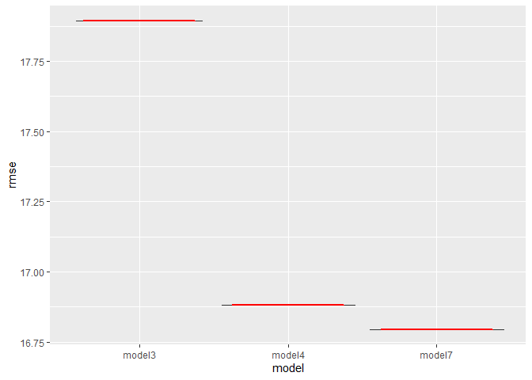<!-- -->

## Model Selection

Examining 7 candidate models using some measures of goodness, including
Cp, AIC, BIC, adjusted R^2, partial F-test for nested models, and
bootstrap.

### Interaction

Model 4 is the model with interaction terms after backward selection.
The interaction terms include number of people per square mile with
number of hospital beds per thousand people, number of people per square
mile with percent of population with income below poverty level, and
number of people per square mile with region. Since the difference
between model 4 and model 3 is the added interaction terms, performing a
partial F-test can verify whether the interaction terms significantly
improve our model or not. If the p-value is less than *α* = 0.05, it
indicates that the interaction terms do help to improve the model and we
should include them.

``` r
anova(model3, model4) %>% knitr::kable(caption = "ANOVA Table", digits = 3 )
```

| Res.Df |      RSS |  Df | Sum of Sq |      F | Pr(&gt;F) |
|-------:|---------:|----:|----------:|-------:|----------:|
|    431 | 140871.9 |  NA |        NA |     NA |        NA |
|    426 | 125410.5 |   5 |  15461.39 | 10.504 |         0 |

ANOVA Table

Based on the ANOVA table, the p-value is extremely close to 0,
indicating that the interaction terms should be preserved and model 4 is
relatively better than model 3. However, results of comparisons based on
other criteria will be considered as well.

``` r
model_list = list(model1 = model1, model2 = model2, model3 = model3, model4 = model4, model5 = model5, model6 = model6, model7 = model7)

output_list = lapply(model_list, glance)
output_df = bind_rows(output_list) %>%
  dplyr::select(adj.r.squared, AIC, BIC)

#write a function to get Mallow's Cp for every model.
Cp_func = function(x) {
  Cp = ols_mallows_cp(x, model1)
}

Cp_val = map(model_list, Cp_func) %>% bind_rows() %>% 
  pivot_longer(
    1:7,
    names_to = "Model",
    names_prefix = "model",
    values_to = "Cp"
  ) %>% 
  mutate(Model = if_else(Model == "1", gsub("1", "full model", Model), Model))

#Get number of parameters
output = vector(length = 7)
for (i in 1:7) {
  output[i] = length(coef(model_list[[i]]))
}
output = output %>% as_tibble() %>% rename(Num_Parameters = value)

#Make Comparison Table
output_df = bind_cols(output_df, Cp_val) %>% 
  relocate(Model) %>% 
  mutate(Cp = round(Cp, digits = 3)) %>% 
  rename(Adj_R_Sq = adj.r.squared) %>% 
  mutate(Adj_R_Sq = round(Adj_R_Sq, digits = 3))

output_df_final = bind_cols(output_df, output) %>%
  knitr::kable(col.names = c("Model", "Adjusted $R^2$", "AIC", "BIC", "Cp", "Number of Parameters"), captions = "Model Comparison Table")

output_df_final
```

| Model      | Adjusted *R*<sup>2</sup> |      AIC |      BIC |      Cp | Number of Parameters |
|:-----------|-------------------------:|---------:|---------:|--------:|---------------------:|
| full model |                    0.608 | 3766.076 | 3839.638 |  13.000 |                   17 |
| 2          |                    0.561 | 3810.282 | 3859.323 |  58.637 |                   11 |
| 3          |                    0.562 | 3806.952 | 3847.820 |  55.370 |                    9 |
| 4          |                    0.606 | 3765.798 | 3827.100 |   8.537 |                   14 |
| 5          |                    0.445 | 3910.270 | 3947.051 | 187.549 |                    8 |
| 6          |                    0.444 | 3910.173 | 3942.868 | 188.200 |                    7 |
| 7          |                    0.611 | 3759.247 | 3816.462 |   6.128 |                   13 |

The optimal model is selected based on various criteria. We use 5
methods to compare different candidate models. The adjusted
*R*<sup>2</sup> is an improved version of *R*<sup>2</sup>, which only
increases if the predictor is significant. In this case, it measures the
percentage of change in crime rate per 1000 people that the predictors
can explain collectively in a model. Higher adjusted *R*<sup>2</sup>
value represents smaller difference between the observed and fitted
value. Thus, based on the table, model 1, 4, and 7 have relatively
highest *R*<sup>2</sup> values, but since model 1 is the full model, we
choose to neglect it and focus on reduced models with similar strength
instead. AIC and BIC are both information criteria which they penalize
for complexity and reward for goodness of fit. Lower AIC/BIC values are
preferred. Based on the table, model 4 and 7 have the lowest AIC and BIC
values. Mallow’s Cp compares the reduced model with the full model and
measures the amount of error unexplained by the reduced model. Model
with lower Cp or Cp close to the number of parameters is preferred. We
can compare the number of parameters listed in the table with the Cp
value for each model. It is quite obvious to observe that Model 4 and 7
have the lowest Cp and the finding is consistent with other criteria.

The criterion above helped us to find two best candidate models,
however, these measures are all internal, which only provide information
of how well the model fits the training data. To evaluate the
performance of the model, and since our models are fitted using the
whole dataset, we choose to apply bootstrap resampling method to measure
the accuracy. By evaluating the model on every randomly selected sample
of the original dataset, we can get an averaged value of the standard
error.

``` r
set.seed(1)
# Define training control
train.control <- trainControl(method = "boot", number = 1000)
# Train the model
boot_model7 = train(crm_1000 ~ pop + pop18 + beds + hsgrad + bagrad + poverty + pcincome + totalinc + poparea + region, data = cdi, method = "lm", trControl = train.control)

boot_model4 = train(crm_1000 ~ pop18 + pcincome + poverty + beds + poparea + region + poparea*region + poparea*poverty + poparea*beds, data = cdi, method = "lm", trControl = train.control)
# Summarize the results
res_4 = boot_model4$results %>% as_tibble() %>% dplyr::select(RMSE) %>% mutate(Model = "Model4")

res_7 = boot_model7$results %>% as_tibble() %>% dplyr::select(RMSE) %>% 
  mutate(Model = "Model7")

res = rbind(res_4,res_7) %>% relocate(Model) %>% 
  knitr::kable(caption = "RMSE Table", col.names = c("Model", "RMSE"))

res
```

| Model  |     RMSE |
|:-------|---------:|
| Model4 | 18.90105 |
| Model7 | 19.01657 |

RMSE Table

The 1000 bootstrapping samples of the original data provide us the
estimated Root Mean Squared Error of the model, which measures the
average prediction error made of the model in predicting the outcome and
tell us how accurate the predictions are. In the table above, model 4
has a smaller RMSE value but the difference is rather small. However,
since model 7 is purely based on stepwise selection, it only provides us
as a guide of what a “good” model under automatic procedure looks like.
Thus, based on the above observation, model 4 is considered as the
optimal model for predicting the crime rate per 1000 people for each
county for now.

## Model Diagnostics

residual vs fitted plot

``` r
par(mfrow = c(1,2))


plot(model4, which = 1)
plot(model7, which = 1)
```

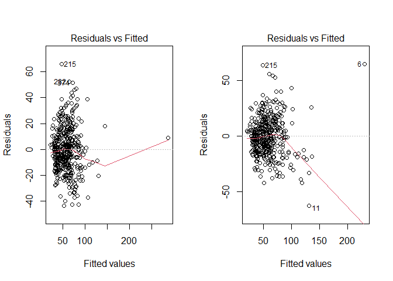<!-- -->

QQ plot

``` r
par(mfrow = c(1,2))


plot(model4, which = 2)
plot(model7, which = 2)
```

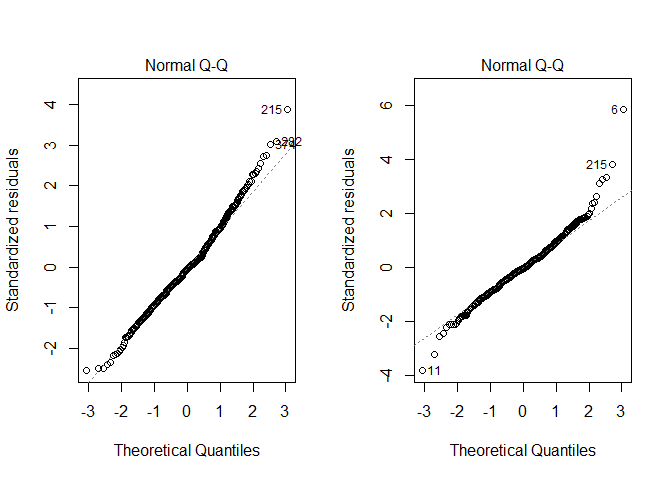<!-- -->

Scale-Location

``` r
par(mfrow = c(1,2))


plot(model4, which = 3)
plot(model7, which = 3)
```

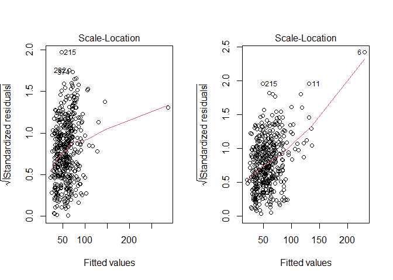<!-- -->

Residual

``` r
par(mfrow = c(1,2))


plot(model4, which = 5)
plot(model7, which = 5)
```

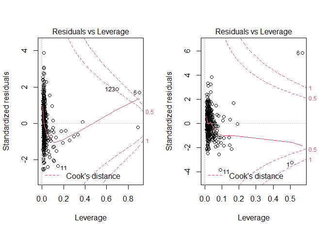<!-- -->

### Box-Cox transformation

``` r
boxcox(model4, lambda = seq(-5, 5, by = 0.15))
```

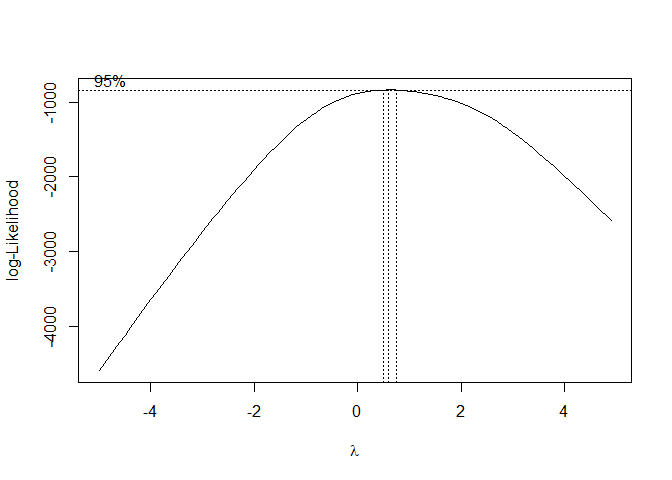<!-- -->

``` r
boxcox(model7, lambda = seq(-5, 5, by = 0.15))
```

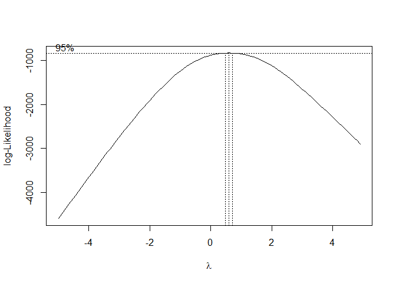<!-- -->

### outliers

``` r
par(mfrow = c(1,2))
plot(model4, which = 6)
plot(model7, which = 6)
```

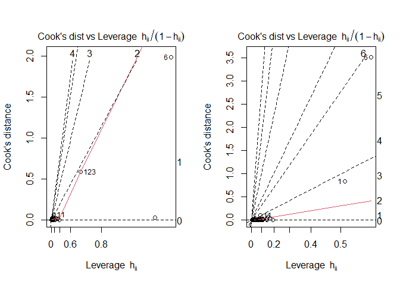<!-- -->

``` r
sum_cdi = cdi
summary(sum_cdi)
```

    ##       area              pop              pop18           pop65       
    ##  Min.   :   15.0   Min.   : 100043   Min.   :16.40   Min.   : 3.000  
    ##  1st Qu.:  451.2   1st Qu.: 139027   1st Qu.:26.20   1st Qu.: 9.875  
    ##  Median :  656.5   Median : 217280   Median :28.10   Median :11.750  
    ##  Mean   : 1041.4   Mean   : 393011   Mean   :28.57   Mean   :12.170  
    ##  3rd Qu.:  946.8   3rd Qu.: 436064   3rd Qu.:30.02   3rd Qu.:13.625  
    ##  Max.   :20062.0   Max.   :8863164   Max.   :49.70   Max.   :33.800  
    ##       docs              beds             hsgrad          bagrad     
    ##  Min.   : 0.3559   Min.   : 0.1649   Min.   :46.60   Min.   : 8.10  
    ##  1st Qu.: 1.2127   1st Qu.: 2.1972   1st Qu.:73.88   1st Qu.:15.28  
    ##  Median : 1.7509   Median : 3.3287   Median :77.70   Median :19.70  
    ##  Mean   : 2.1230   Mean   : 3.6493   Mean   :77.56   Mean   :21.08  
    ##  3rd Qu.: 2.4915   3rd Qu.: 4.5649   3rd Qu.:82.40   3rd Qu.:25.32  
    ##  Max.   :17.0377   Max.   :19.6982   Max.   :92.90   Max.   :52.30  
    ##     poverty           unemp           pcincome        totalinc      region 
    ##  Min.   : 1.400   Min.   : 2.200   Min.   : 8899   Min.   :  1141   1:103  
    ##  1st Qu.: 5.300   1st Qu.: 5.100   1st Qu.:16118   1st Qu.:  2311   2:108  
    ##  Median : 7.900   Median : 6.200   Median :17759   Median :  3857   3:152  
    ##  Mean   : 8.721   Mean   : 6.597   Mean   :18561   Mean   :  7869   4: 77  
    ##  3rd Qu.:10.900   3rd Qu.: 7.500   3rd Qu.:20270   3rd Qu.:  8654          
    ##  Max.   :36.300   Max.   :21.300   Max.   :37541   Max.   :184230          
    ##     poparea            crm_1000      
    ##  Min.   :   13.26   Min.   :  4.601  
    ##  1st Qu.:  192.34   1st Qu.: 38.102  
    ##  Median :  335.91   Median : 52.429  
    ##  Mean   :  888.44   Mean   : 57.286  
    ##  3rd Qu.:  756.55   3rd Qu.: 72.597  
    ##  Max.   :32403.72   Max.   :295.987

``` r
sum_cdi_4 = sum_cdi[-c(215,6),]
```

for model 4

``` r
old4 = lm(crm_1000 ~ pop18 + pcincome + poverty + beds + poparea + region + poparea*region + poparea*poverty + poparea*beds, data = cdi)
new4 = lm(crm_1000 ~ pop18 + pcincome + poverty + beds + poparea + region + poparea*region + poparea*poverty + poparea*beds, data = sum_cdi_4)
summary(old4); summary(new4)
```

    ## 
    ## Call:
    ## lm(formula = crm_1000 ~ pop18 + pcincome + poverty + beds + poparea + 
    ##     region + poparea * region + poparea * poverty + poparea * 
    ##     beds, data = cdi)
    ## 
    ## Residuals:
    ##     Min      1Q  Median      3Q     Max 
    ## -43.405 -11.295  -0.824  10.180  65.892 
    ## 
    ## Coefficients:
    ##                   Estimate Std. Error t value Pr(>|t|)    
    ## (Intercept)     -3.755e+01  9.697e+00  -3.872 0.000125 ***
    ## pop18            8.416e-01  2.029e-01   4.147 4.07e-05 ***
    ## pcincome         1.471e-03  3.170e-04   4.639 4.66e-06 ***
    ## poverty          1.586e+00  2.709e-01   5.854 9.60e-09 ***
    ## beds             3.118e+00  5.576e-01   5.591 4.05e-08 ***
    ## poparea         -4.149e-04  1.925e-03  -0.215 0.829493    
    ## region2          7.591e+00  2.894e+00   2.623 0.009026 ** 
    ## region3          2.754e+01  2.675e+00  10.295  < 2e-16 ***
    ## region4          2.468e+01  2.970e+00   8.308 1.31e-15 ***
    ## poparea:region2  4.945e-03  1.908e-03   2.592 0.009880 ** 
    ## poparea:region3 -4.732e-04  1.278e-03  -0.370 0.711350    
    ## poparea:region4 -9.677e-04  1.393e-03  -0.694 0.487784    
    ## poverty:poparea  4.929e-04  1.006e-04   4.900 1.37e-06 ***
    ## beds:poparea    -5.161e-04  1.802e-04  -2.863 0.004400 ** 
    ## ---
    ## Signif. codes:  0 '***' 0.001 '**' 0.01 '*' 0.05 '.' 0.1 ' ' 1
    ## 
    ## Residual standard error: 17.16 on 426 degrees of freedom
    ## Multiple R-squared:  0.6175, Adjusted R-squared:  0.6058 
    ## F-statistic:  52.9 on 13 and 426 DF,  p-value: < 2.2e-16

    ## 
    ## Call:
    ## lm(formula = crm_1000 ~ pop18 + pcincome + poverty + beds + poparea + 
    ##     region + poparea * region + poparea * poverty + poparea * 
    ##     beds, data = sum_cdi_4)
    ## 
    ## Residuals:
    ##    Min     1Q Median     3Q    Max 
    ## -43.66 -10.98  -0.38  10.18  52.51 
    ## 
    ## Coefficients:
    ##                   Estimate Std. Error t value Pr(>|t|)    
    ## (Intercept)     -3.492e+01  9.534e+00  -3.663 0.000281 ***
    ## pop18            8.231e-01  1.991e-01   4.133 4.31e-05 ***
    ## pcincome         1.329e-03  3.131e-04   4.246 2.68e-05 ***
    ## poverty          1.655e+00  2.721e-01   6.082 2.65e-09 ***
    ## beds             2.950e+00  5.520e-01   5.345 1.48e-07 ***
    ## poparea          4.355e-04  1.908e-03   0.228 0.819598    
    ## region2          8.136e+00  2.845e+00   2.859 0.004457 ** 
    ## region3          2.780e+01  2.646e+00  10.510  < 2e-16 ***
    ## region4          2.490e+01  2.935e+00   8.482 3.72e-16 ***
    ## poparea:region2  5.009e-03  1.873e-03   2.674 0.007780 ** 
    ## poparea:region3 -1.348e-04  1.278e-03  -0.105 0.916054    
    ## poparea:region4 -7.440e-04  1.384e-03  -0.537 0.591220    
    ## poverty:poparea  2.540e-04  1.583e-04   1.605 0.109295    
    ## beds:poparea    -2.326e-04  2.352e-04  -0.989 0.323223    
    ## ---
    ## Signif. codes:  0 '***' 0.001 '**' 0.01 '*' 0.05 '.' 0.1 ' ' 1
    ## 
    ## Residual standard error: 16.83 on 424 degrees of freedom
    ## Multiple R-squared:  0.5512, Adjusted R-squared:  0.5375 
    ## F-statistic: 40.06 on 13 and 424 DF,  p-value: < 2.2e-16

``` r
par(mfrow = c(1,2))
plot(old4, which = 2)
plot(new4, which = 2)
```

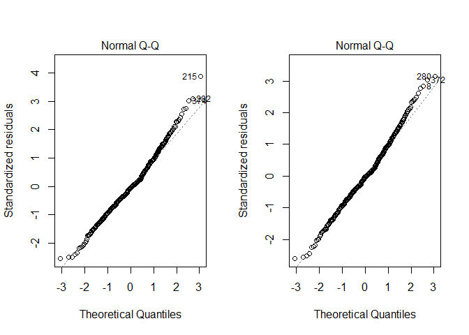<!-- -->

``` r
sum_cdi_7 = sum_cdi[-c(6,1),]
```

for model 7

``` r
old7 = lm(crm_1000 ~ pop + pop18 + beds + hsgrad + bagrad + poverty + pcincome + totalinc + poparea + region, data = cdi)
new7 = lm(crm_1000 ~ pop + pop18 + beds + hsgrad + bagrad + poverty + pcincome + totalinc + poparea + region, data = sum_cdi_7)
summary(old7); summary(new7)
```

    ## 
    ## Call:
    ## lm(formula = crm_1000 ~ pop + pop18 + beds + hsgrad + bagrad + 
    ##     poverty + pcincome + totalinc + poparea + region, data = cdi)
    ## 
    ## Residuals:
    ##     Min      1Q  Median      3Q     Max 
    ## -62.356 -10.092  -0.996   9.624  65.040 
    ## 
    ## Coefficients:
    ##               Estimate Std. Error t value Pr(>|t|)    
    ## (Intercept) -9.164e+01  2.378e+01  -3.853 0.000134 ***
    ## pop          8.049e-05  1.218e-05   6.609 1.15e-10 ***
    ## pop18        8.877e-01  2.732e-01   3.250 0.001246 ** 
    ## beds         2.376e+00  4.811e-01   4.939 1.13e-06 ***
    ## hsgrad       4.860e-01  2.522e-01   1.927 0.054628 .  
    ## bagrad      -6.182e-01  2.700e-01  -2.290 0.022534 *  
    ## poverty      2.065e+00  3.450e-01   5.984 4.60e-09 ***
    ## pcincome     2.717e-03  5.116e-04   5.310 1.77e-07 ***
    ## totalinc    -3.646e-03  5.864e-04  -6.218 1.20e-09 ***
    ## poparea      4.240e-03  4.414e-04   9.606  < 2e-16 ***
    ## region2      9.213e+00  2.544e+00   3.621 0.000328 ***
    ## region3      2.674e+01  2.416e+00  11.068  < 2e-16 ***
    ## region4      2.052e+01  2.939e+00   6.982 1.12e-11 ***
    ## ---
    ## Signif. codes:  0 '***' 0.001 '**' 0.01 '*' 0.05 '.' 0.1 ' ' 1
    ## 
    ## Residual standard error: 17.05 on 427 degrees of freedom
    ## Multiple R-squared:  0.6214, Adjusted R-squared:  0.6108 
    ## F-statistic: 58.41 on 12 and 427 DF,  p-value: < 2.2e-16

    ## 
    ## Call:
    ## lm(formula = crm_1000 ~ pop + pop18 + beds + hsgrad + bagrad + 
    ##     poverty + pcincome + totalinc + poparea + region, data = sum_cdi_7)
    ## 
    ## Residuals:
    ##     Min      1Q  Median      3Q     Max 
    ## -43.062 -10.255  -0.578   8.680  60.451 
    ## 
    ## Coefficients:
    ##               Estimate Std. Error t value Pr(>|t|)    
    ## (Intercept) -8.904e+01  2.263e+01  -3.934 9.77e-05 ***
    ## pop          7.245e-05  1.172e-05   6.182 1.49e-09 ***
    ## pop18        1.168e+00  2.630e-01   4.439 1.15e-05 ***
    ## beds         3.020e+00  4.652e-01   6.492 2.37e-10 ***
    ## hsgrad       2.943e-01  2.404e-01   1.224   0.2217    
    ## bagrad      -6.304e-01  2.562e-01  -2.460   0.0143 *  
    ## poverty      1.955e+00  3.287e-01   5.950 5.62e-09 ***
    ## pcincome     2.887e-03  4.935e-04   5.851 9.75e-09 ***
    ## totalinc    -3.001e-03  5.634e-04  -5.328 1.62e-07 ***
    ## poparea      1.230e-03  6.078e-04   2.024   0.0436 *  
    ## region2      9.718e+00  2.412e+00   4.028 6.65e-05 ***
    ## region3      2.733e+01  2.292e+00  11.926  < 2e-16 ***
    ## region4      2.189e+01  2.794e+00   7.835 3.78e-14 ***
    ## ---
    ## Signif. codes:  0 '***' 0.001 '**' 0.01 '*' 0.05 '.' 0.1 ' ' 1
    ## 
    ## Residual standard error: 16.15 on 425 degrees of freedom
    ## Multiple R-squared:  0.5899, Adjusted R-squared:  0.5783 
    ## F-statistic: 50.95 on 12 and 425 DF,  p-value: < 2.2e-16

``` r
par(mfrow = c(1,2))
plot(old7, which = 2)
plot(new7, which = 2)
```

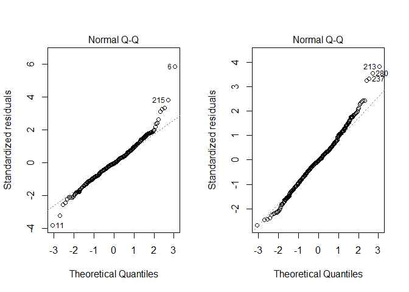<!-- -->

### colinearility

``` r
cdi %>% 
  dplyr::select(-crm_1000) %>% 
  mutate(
    region = factor(region)) %>%
  GGally::ggcorr(label = TRUE, label_size = 2, hjust = 0.8)
```

    ## Warning in GGally::ggcorr(., label = TRUE, label_size = 2, hjust = 0.8): data in
    ## column(s) 'region' are not numeric and were ignored

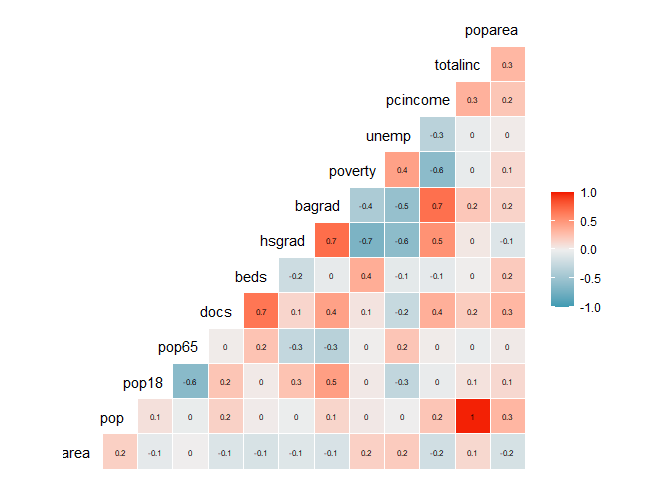<!-- -->
pop and totalinc(1) pcincome and bagrad(0.7) hsgrad and bagrad(0.7) beds
and docs(0.7)

``` r
check_collinearity(model4) 
```

    ## # Check for Multicollinearity
    ## 
    ## Low Correlation
    ## 
    ##             Term  VIF Increased SE Tolerance
    ##            pop18 1.06         1.03      0.95
    ##         pcincome 1.07         1.03      0.94
    ##          poverty 1.35         1.16      0.74
    ##             beds 1.39         1.18      0.72
    ##          poparea 1.32         1.15      0.76
    ##           region 4.73         2.18      0.21
    ##   poparea:region 4.01         2.00      0.25
    ##  poverty:poparea 1.00         1.00      1.00
    ##     beds:poparea 1.01         1.00      0.99

``` r
check_collinearity(model7)
```

    ## # Check for Multicollinearity
    ## 
    ## Low Correlation
    ## 
    ##      Term  VIF Increased SE Tolerance
    ##       pop 1.00         1.00      1.00
    ##     pop18 1.94         1.39      0.52
    ##      beds 1.32         1.15      0.75
    ##    hsgrad 3.14         1.77      0.32
    ##    bagrad 3.35         1.83      0.30
    ##   poverty 2.16         1.47      0.46
    ##  pcincome 1.03         1.01      0.97
    ##  totalinc 1.00         1.00      1.00
    ##   poparea 1.01         1.00      0.99
    ##    region 1.63         1.28      0.61

``` r
par(mfrow = c(2,2))
plot(model7)
```

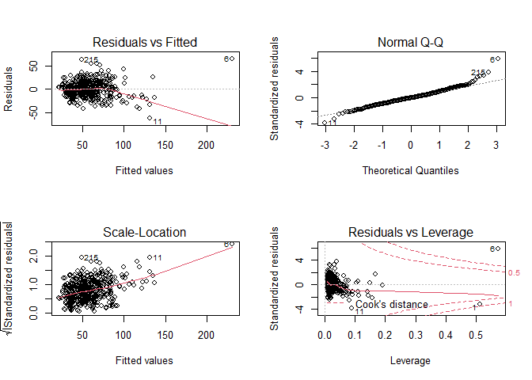<!-- -->
