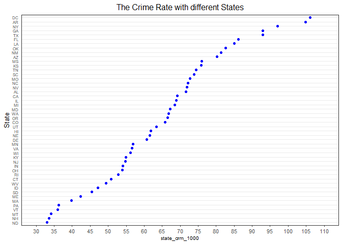

data exploration
================
XIAO MA
12/12/2021

``` r
cdi = read_csv("./data/cdi.csv") %>%
  janitor::clean_names() 
```

    ## Rows: 440 Columns: 17

    ## -- Column specification --------------------------------------------------------
    ## Delimiter: ","
    ## chr  (2): cty, state
    ## dbl (15): id, area, pop, pop18, pop65, docs, beds, crimes, hsgrad, bagrad, p...

    ## 
    ## i Use `spec()` to retrieve the full column specification for this data.
    ## i Specify the column types or set `show_col_types = FALSE` to quiet this message.

``` r
# Create a new variable called crm_1000, which is the crime rate per 1000 population in each county in year 1990, and another variable poparea which is the population density per square mile. Also change the number of doctors and beds into doctors and beds per 1000 population.

cdi = cdi %>% 
  mutate(
    poparea = pop/area,
    crm_1000 = (crimes/pop)*1000,
    docs = (docs/pop) * 1000,
    beds = (beds/pop) * 1000
  )
```

## Pairwise

``` r
ggpairs(cdi[,-c(1,2,3)])
```

<!-- -->

From the pairwise plot, we observed the correlation and distribution
between each two variables. Although the high absolute value of
correlation indicate strong relationship, it may not be linear relation.
The association between crime rate to each variable was displayed in the
last row. No strong linear relationship was detected between crime rate
per 1000 person and other variables.

## Marginal

``` r
p = ggplot(cdi, aes(x=bagrad, y=crm_1000)) +
      geom_point() +
      theme(legend.position="none")
p1 = ggMarginal(p, type = "density")
p1
```

<!-- -->

## Crime Rate Comparison Across Region

``` r
#CRM_1000 vs. Geographic Region
cdi_region = cdi %>%
  group_by(region) %>%
  summarise(region_crm_1000 = sum(crimes)*1000/sum(pop)) %>%
  arrange(desc(region_crm_1000))

cdi_region = cdi_region %>%
  mutate(region_cla = case_when(
  region == 1 ~ "Northeast",
  region == 2 ~ "North Central",
  region == 3 ~ "South",
  region == 4 ~ "West")) %>% 
  mutate(region_cla = as.factor(region_cla)) %>% 
  arrange(region_cla,region_crm_1000)

ggplot(cdi_region) + 
  geom_bar(stat = "identity",aes( y = region_crm_1000,reorder(region_cla,+region_crm_1000)),fill = "darkblue",width = 0.3) +
  labs(x = "Region", y = "Crime Rate",title = "The Crime Rate of Each Geographic Region") +
  theme(plot.title = element_text(hjust = 0.5))
```

<!-- -->

Southern US have highest crime rate.

## State crime( find the state with unusual crime rate)

``` r
#CRM_1000 vs. state
cdi_state = cdi %>%
  group_by(state) %>%
  summarise(state_crm_1000 = sum(crimes)*1000/sum(pop)) %>%
  arrange(desc(state_crm_1000))

theme_dotplot <- theme_bw(10) +
    theme(axis.text.y = element_text(size = rel(0.75)),
        axis.ticks.y = element_blank(),
        axis.title.x = element_text(size = rel(0.75)),
        panel.grid.major.x = element_blank(),
        panel.grid.major.y = element_line(size = 0.5),
        panel.grid.minor.x = element_blank())

ggplot(cdi_state,aes(state_crm_1000,reorder(state,state_crm_1000))) +
  geom_point(color = "blue") +
  scale_x_continuous(limits = c(30, 110),breaks = seq(30,110,5)) + 
  theme_dotplot +
  labs(y = "State",title = 
         "The Crime Rate with different States") +
  theme(plot.title = element_text(hjust = 0.5))
```

<!-- -->

``` r
ggplot(cdi_state,aes(y = state_crm_1000)) + geom_boxplot()
```

<!-- -->

According to the boxplot, there is no outliers, which means there is no
states with unusual crime rate.

``` r
cdi_desc = cdi %>%
  arrange(desc(crm_1000))
head(cdi_desc)
```

    ## # A tibble: 6 x 19
    ##      id cty      state  area     pop pop18 pop65  docs  beds crimes hsgrad bagrad
    ##   <dbl> <chr>    <chr> <dbl>   <dbl> <dbl> <dbl> <dbl> <dbl>  <dbl>  <dbl>  <dbl>
    ## 1     6 Kings    NY       71 2300664  28.3  12.4  2.11  3.89 680966   63.7   16.6
    ## 2   123 St._Loui MO       62  396685  28.7  16.6 10.6  19.7   64103   62.8   15.3
    ## 3    70 Fulton   GA      529  648951  31.6  10    5.19  8.87  93025   77.8   31.6
    ## 4     9 Dade     FL     1945 1937094  27.1  13.9  3.24  4.56 244725   65     18.8
    ## 5   374 Ector    TX      901  118934  27.1   9.3  1.29  3.27  14643   66.9   11.4
    ## 6   239 Leon     FL      667  192493  38.5   8.2  2.15  4.28  23363   84.9   37.1
    ## # ... with 7 more variables: poverty <dbl>, unemp <dbl>, pcincome <dbl>,
    ## #   totalinc <dbl>, region <dbl>, poparea <dbl>, crm_1000 <dbl>

``` r
ggplot(cdi_desc,aes(y = crm_1000)) + geom_boxplot()
```

<!-- -->

There are four county with unusual crime rate, and they are (Kings, NY),
(123 St.\_Loui, MO),(70, Fulton, GA), (9 Dade, FL)
