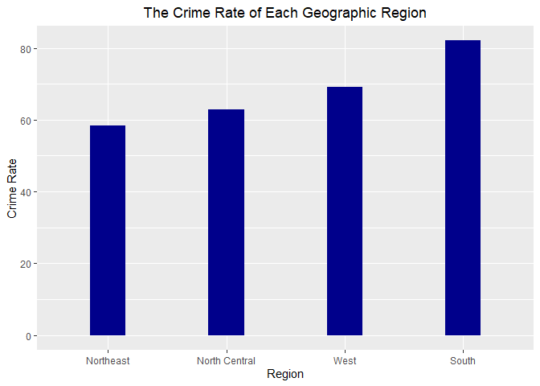
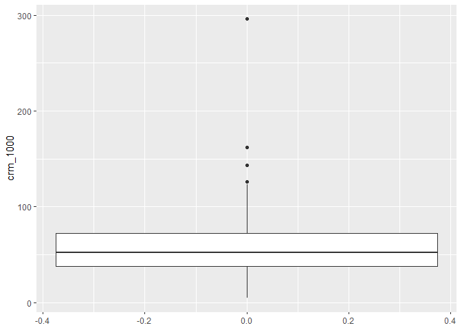

data exploration
================
XIAO MA
12/12/2021

## Import the data set

``` r
cdi = read_csv("./data/cdi.csv") %>%
  janitor::clean_names() 
```

    ## Rows: 440 Columns: 17

    ## ── Column specification ────────────────────────────────────────────────────────
    ## Delimiter: ","
    ## chr  (2): cty, state
    ## dbl (15): id, area, pop, pop18, pop65, docs, beds, crimes, hsgrad, bagrad, p...

    ## 
    ## ℹ Use `spec()` to retrieve the full column specification for this data.
    ## ℹ Specify the column types or set `show_col_types = FALSE` to quiet this message.

``` r
# Create a new variable called crm_1000, which is the crime rate per 1000 population in each county in year 1990, and another variable poparea which is the population density per square mile. Also change the number of doctors and beds into doctors and beds per 1000 population.

cdi = cdi %>% 
  mutate(
    poparea = pop/area,
    crm_1000 = (crimes/pop)*1000,
    docs = (docs/pop) * 1000,
    beds = (beds/pop) * 1000
  )
```

## To preview the data

``` r
glimpse(cdi)
```

    ## Rows: 440
    ## Columns: 19
    ## $ id       <dbl> 1, 2, 3, 4, 5, 6, 7, 8, 9, 10, 11, 12, 13, 14, 15, 16, 17, 18…
    ## $ cty      <chr> "Los_Ange", "Cook", "Harris", "San_Dieg", "Orange", "Kings", …
    ## $ state    <chr> "CA", "IL", "TX", "CA", "CA", "NY", "AZ", "MI", "FL", "TX", "…
    ## $ area     <dbl> 4060, 946, 1729, 4205, 790, 71, 9204, 614, 1945, 880, 135, 21…
    ## $ pop      <dbl> 8863164, 5105067, 2818199, 2498016, 2410556, 2300664, 2122101…
    ## $ pop18    <dbl> 32.1, 29.2, 31.3, 33.5, 32.6, 28.3, 29.2, 27.4, 27.1, 32.6, 2…
    ## $ pop65    <dbl> 9.7, 12.4, 7.1, 10.9, 9.2, 12.4, 12.5, 12.5, 13.9, 8.2, 15.2,…
    ## $ docs     <dbl> 2.671394, 2.968227, 2.680080, 2.363876, 2.514773, 2.112868, 2…
    ## $ beds     <dbl> 3.125295, 4.221296, 4.417360, 2.473563, 2.642129, 3.886704, 2…
    ## $ crimes   <dbl> 688936, 436936, 253526, 173821, 144524, 680966, 177593, 19397…
    ## $ hsgrad   <dbl> 70.0, 73.4, 74.9, 81.9, 81.2, 63.7, 81.5, 70.0, 65.0, 77.1, 6…
    ## $ bagrad   <dbl> 22.3, 22.8, 25.4, 25.3, 27.8, 16.6, 22.1, 13.7, 18.8, 26.3, 1…
    ## $ poverty  <dbl> 11.6, 11.1, 12.5, 8.1, 5.2, 19.5, 8.8, 16.9, 14.2, 10.4, 16.1…
    ## $ unemp    <dbl> 8.0, 7.2, 5.7, 6.1, 4.8, 9.5, 4.9, 10.0, 8.7, 6.1, 8.0, 4.6, …
    ## $ pcincome <dbl> 20786, 21729, 19517, 19588, 24400, 16803, 18042, 17461, 17823…
    ## $ totalinc <dbl> 184230, 110928, 55003, 48931, 58818, 38658, 38287, 36872, 345…
    ## $ region   <dbl> 4, 2, 3, 4, 4, 1, 4, 2, 3, 3, 1, 4, 4, 4, 2, 1, 1, 1, 1, 4, 3…
    ## $ poparea  <dbl> 2183.04532, 5396.47674, 1629.95894, 594.05850, 3051.33671, 32…
    ## $ crm_1000 <dbl> 77.73026, 85.58869, 89.96029, 69.58362, 59.95463, 295.98672, …

``` r
summary(cdi)
```

    ##        id            cty               state                area        
    ##  Min.   :  1.0   Length:440         Length:440         Min.   :   15.0  
    ##  1st Qu.:110.8   Class :character   Class :character   1st Qu.:  451.2  
    ##  Median :220.5   Mode  :character   Mode  :character   Median :  656.5  
    ##  Mean   :220.5                                         Mean   : 1041.4  
    ##  3rd Qu.:330.2                                         3rd Qu.:  946.8  
    ##  Max.   :440.0                                         Max.   :20062.0  
    ##       pop              pop18           pop65             docs        
    ##  Min.   : 100043   Min.   :16.40   Min.   : 3.000   Min.   : 0.3559  
    ##  1st Qu.: 139027   1st Qu.:26.20   1st Qu.: 9.875   1st Qu.: 1.2127  
    ##  Median : 217280   Median :28.10   Median :11.750   Median : 1.7509  
    ##  Mean   : 393011   Mean   :28.57   Mean   :12.170   Mean   : 2.1230  
    ##  3rd Qu.: 436064   3rd Qu.:30.02   3rd Qu.:13.625   3rd Qu.: 2.4915  
    ##  Max.   :8863164   Max.   :49.70   Max.   :33.800   Max.   :17.0377  
    ##       beds             crimes           hsgrad          bagrad     
    ##  Min.   : 0.1649   Min.   :   563   Min.   :46.60   Min.   : 8.10  
    ##  1st Qu.: 2.1972   1st Qu.:  6220   1st Qu.:73.88   1st Qu.:15.28  
    ##  Median : 3.3287   Median : 11820   Median :77.70   Median :19.70  
    ##  Mean   : 3.6493   Mean   : 27112   Mean   :77.56   Mean   :21.08  
    ##  3rd Qu.: 4.5649   3rd Qu.: 26280   3rd Qu.:82.40   3rd Qu.:25.32  
    ##  Max.   :19.6982   Max.   :688936   Max.   :92.90   Max.   :52.30  
    ##     poverty           unemp           pcincome        totalinc     
    ##  Min.   : 1.400   Min.   : 2.200   Min.   : 8899   Min.   :  1141  
    ##  1st Qu.: 5.300   1st Qu.: 5.100   1st Qu.:16118   1st Qu.:  2311  
    ##  Median : 7.900   Median : 6.200   Median :17759   Median :  3857  
    ##  Mean   : 8.721   Mean   : 6.597   Mean   :18561   Mean   :  7869  
    ##  3rd Qu.:10.900   3rd Qu.: 7.500   3rd Qu.:20270   3rd Qu.:  8654  
    ##  Max.   :36.300   Max.   :21.300   Max.   :37541   Max.   :184230  
    ##      region         poparea            crm_1000      
    ##  Min.   :1.000   Min.   :   13.26   Min.   :  4.601  
    ##  1st Qu.:2.000   1st Qu.:  192.34   1st Qu.: 38.102  
    ##  Median :3.000   Median :  335.91   Median : 52.429  
    ##  Mean   :2.461   Mean   :  888.44   Mean   : 57.286  
    ##  3rd Qu.:3.000   3rd Qu.:  756.55   3rd Qu.: 72.597  
    ##  Max.   :4.000   Max.   :32403.72   Max.   :295.987

## Draw pairwise plot to check association betwee every two variable

``` r
ggpairs(cdi[,-c(1,2,3,10)])
```

<!-- -->

From the pairwise plot, we observed the correlation and distribution
between every two variables. The association between crime rate to each
variable was displayed in the last row. No strong linear relationship
was detected between the crime rate per 1000 person and other variables.
Between variables, we noticed that Percent of population aged 18-34 have
negative relation with Percent of population aged 65+. Although the high
absolute value of correlation indicates a strong relationship, it may
not be linear relation.

## Take a look of variables with high correlations

``` r
totalinc_pop = ggplot(cdi, aes(x = totalinc, y = pop)) +
      geom_point() +
      theme(legend.position = "none")
ggMarginal(totalinc_pop, type = "density")


#not ob linear
pop18_pop65 = ggplot(cdi, aes(x = pop18, y = pop65)) + geom_point() +
      theme(legend.position = "none")
ggMarginal(pop18_pop65, type = "density")

#not ob linear
hsgrad_bagrad = ggplot(cdi, aes(x = hsgrad, y = bagrad)) + geom_point() +
      theme(legend.position = "none")
ggMarginal(hsgrad_bagrad , type = "density")


hsgrad_poverty = ggplot(cdi, aes(x = hsgrad, y = poverty)) + geom_point() +
      theme(legend.position = "none")
ggMarginal(hsgrad_poverty, type = "density")


hsgrad_unemp = ggplot(cdi, aes(x = hsgrad, y = unemp)) + geom_point() +
      theme(legend.position = "none")
ggMarginal(hsgrad_unemp , type = "density")


hsgrad_pcincome = ggplot(cdi, aes(x = hsgrad, y = pcincome)) + geom_point() +
      theme(legend.position = "none")
ggMarginal(hsgrad_pcincome, type = "density")

bagrad_pcincome = ggplot(cdi, aes(x = bagrad, y = pcincome)) + geom_point() +
      theme(legend.position = "none")
ggMarginal(bagrad_pcincome, type = "density")


bagrad_unemp = ggplot(cdi, aes(x = bagrad, y = unemp)) + geom_point() +
      theme(legend.position = "none")
ggMarginal(bagrad_unemp, type = "density")


bagrad_poverty = ggplot(cdi, aes(x = bagrad, y = poverty)) + geom_point() +
      theme(legend.position = "none")
ggMarginal(bagrad_poverty, type = "density")
```

<!-- -->

## Crime Rate Comparison Across Region

``` r
#CRM_1000 vs. Geographic Region
cdi_region = cdi %>%
  group_by(region) %>%
  summarise(region_crm_1000 = sum(crimes)*1000/sum(pop)) %>%
  arrange(desc(region_crm_1000))

cdi_region = cdi_region %>%
  mutate(region_cla = case_when(
  region == 1 ~ "Northeast",
  region == 2 ~ "North Central",
  region == 3 ~ "South",
  region == 4 ~ "West")) %>% 
  mutate(region_cla = as.factor(region_cla)) %>% 
  arrange(region_cla,region_crm_1000)

ggplot(cdi_region) + 
  geom_bar(stat = "identity",aes( y = region_crm_1000,reorder(region_cla,+region_crm_1000)),fill = "darkblue",width = 0.3) +
  labs(x = "Region", y = "Crime Rate",title = "The Crime Rate of Each Geographic Region") +
  theme(plot.title = element_text(hjust = 0.5))
```

<!-- -->

Southern US have highest crime rate.

## State crime( find the state with unusual crime rate)

``` r
#CRM_1000 vs. state
cdi_state = cdi %>%
  group_by(state) %>%
  summarise(state_crm_1000 = sum(crimes)*1000/sum(pop)) %>%
  arrange(desc(state_crm_1000))

theme_dotplot <- theme_bw(10) +
    theme(axis.text.y = element_text(size = rel(0.75)),
        axis.ticks.y = element_blank(),
        axis.title.x = element_text(size = rel(0.75)),
        panel.grid.major.x = element_blank(),
        panel.grid.major.y = element_line(size = 0.5),
        panel.grid.minor.x = element_blank())

ggplot(cdi_state,aes(state_crm_1000,reorder(state,state_crm_1000))) +
  geom_point(color = "blue") +
  scale_x_continuous(limits = c(30, 110),breaks = seq(30,110,5)) + 
  theme_dotplot +
  labs(y = "State",title = 
         "The Crime Rate with different States") +
  theme(plot.title = element_text(hjust = 0.5))
```

<!-- -->

``` r
ggplot(cdi_state,aes(y = state_crm_1000)) + geom_boxplot()
```

<!-- -->

According to the boxplot, there is no outliers, which means there is no
states with unusual crime rate.

``` r
cdi_desc = cdi %>%
  arrange(desc(crm_1000))
head(cdi_desc)
```

    ## # A tibble: 6 × 19
    ##      id cty      state  area     pop pop18 pop65  docs  beds crimes hsgrad bagrad
    ##   <dbl> <chr>    <chr> <dbl>   <dbl> <dbl> <dbl> <dbl> <dbl>  <dbl>  <dbl>  <dbl>
    ## 1     6 Kings    NY       71 2300664  28.3  12.4  2.11  3.89 680966   63.7   16.6
    ## 2   123 St._Loui MO       62  396685  28.7  16.6 10.6  19.7   64103   62.8   15.3
    ## 3    70 Fulton   GA      529  648951  31.6  10    5.19  8.87  93025   77.8   31.6
    ## 4     9 Dade     FL     1945 1937094  27.1  13.9  3.24  4.56 244725   65     18.8
    ## 5   374 Ector    TX      901  118934  27.1   9.3  1.29  3.27  14643   66.9   11.4
    ## 6   239 Leon     FL      667  192493  38.5   8.2  2.15  4.28  23363   84.9   37.1
    ## # … with 7 more variables: poverty <dbl>, unemp <dbl>, pcincome <dbl>,
    ## #   totalinc <dbl>, region <dbl>, poparea <dbl>, crm_1000 <dbl>

``` r
ggplot(cdi_desc,aes(y = crm_1000)) + geom_boxplot()
```

<!-- -->

There are four county with unusual crime rate, and they are (Kings, NY),
(123 St.\_Loui, MO),(70, Fulton, GA), (9 Dade, FL)
