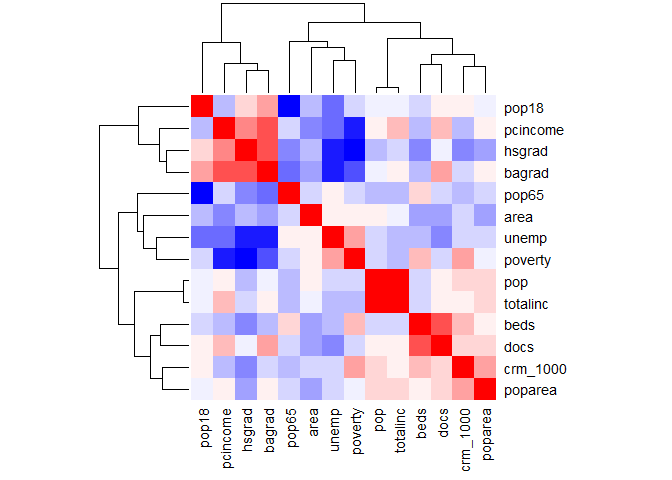
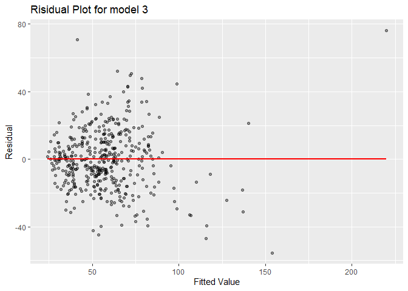
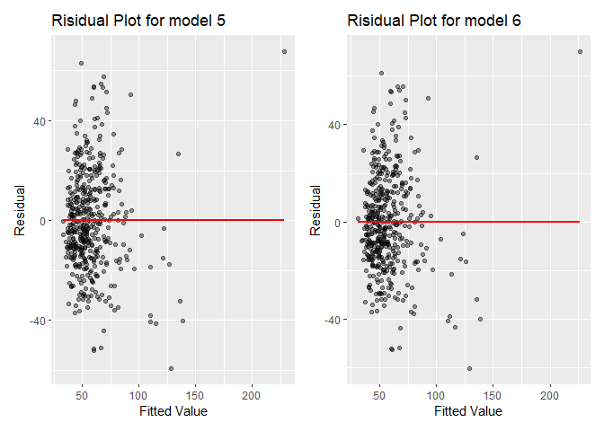
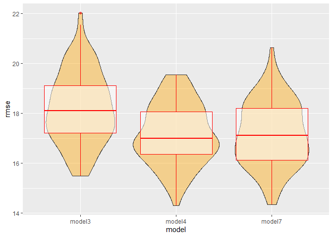

mlr
================
Hao Zheng
12/12/2021

``` r
library(tidyverse)
```

    ## -- Attaching packages --------------------------------------- tidyverse 1.3.1 --

    ## v ggplot2 3.3.5     v purrr   0.3.4
    ## v tibble  3.1.4     v dplyr   1.0.7
    ## v tidyr   1.1.3     v stringr 1.4.0
    ## v readr   2.0.1     v forcats 0.5.1

    ## -- Conflicts ------------------------------------------ tidyverse_conflicts() --
    ## x dplyr::filter() masks stats::filter()
    ## x dplyr::lag()    masks stats::lag()

``` r
library(modelr)
library(patchwork)

cdi = read.csv("./data/cdi.csv")
```

## Multiple Linear Regression Model

Next, we try to fit a multiple regression model over the variables, with
the newly created variable crm\_1000 as the outcome.

``` r
# Create a new variable called crm_1000, which is the crime rate per 1000 population in each county in year 1990, and another variable poparea which is the population density per square mile. Also change the number of doctors and beds into doctors and beds per 1000 population.

cdi = 
  cdi %>% 
  mutate(
    # crm_1000 is already generated in Xiao's part
    crm_1000 = crimes/pop * 1000,
    poparea = pop/area,
    docs = docs/pop * 1000,
    beds = beds/pop * 1000,
    # mutatation for the region needs to stay here (not in Xiao's part)
    region = as.factor(region)
  ) %>% 
  select(-id,-cty,-state,-crimes)
```

### Model 1: Full model

Let’s first fit the model with all the predictors:

``` r
model1 = lm(crm_1000 ~ ., data = cdi)

broom::tidy(model1) %>% 
  knitr::kable()
```

| term        |    estimate |  std.error |  statistic |   p.value |
|:------------|------------:|-----------:|-----------:|----------:|
| (Intercept) | -95.5189646 | 26.6636149 | -3.5823711 | 0.0003801 |
| area        |  -0.0003144 |  0.0006703 | -0.4690426 | 0.6392809 |
| pop         |   0.0000812 |  0.0000127 |  6.4106097 | 0.0000000 |
| pop18       |   0.8704346 |  0.3191779 |  2.7271140 | 0.0066549 |
| pop65       |  -0.0580139 |  0.2952493 | -0.1964914 | 0.8443200 |
| docs        |  -0.4149594 |  0.9805516 | -0.4231898 | 0.6723719 |
| beds        |   2.7526148 |  0.7668761 |  3.5893864 | 0.0003703 |
| hsgrad      |   0.5090193 |  0.2591722 |  1.9640197 | 0.0501822 |
| bagrad      |  -0.5422934 |  0.2855774 | -1.8989367 | 0.0582530 |
| poverty     |   1.9594621 |  0.3721326 |  5.2654943 | 0.0000002 |
| unemp       |   0.4436160 |  0.5117840 |  0.8668031 | 0.3865413 |
| pcincome    |   0.0026666 |  0.0005272 |  5.0584493 | 0.0000006 |
| totalinc    |  -0.0036681 |  0.0006068 | -6.0449586 | 0.0000000 |
| region2     |   9.3014507 |  2.6258092 |  3.5423178 | 0.0004408 |
| region3     |  27.2932342 |  2.5581241 | 10.6692379 | 0.0000000 |
| region4     |  21.3813487 |  3.2291786 |  6.6212965 | 0.0000000 |
| poparea     |   0.0042337 |  0.0004608 |  9.1868758 | 0.0000000 |

We can see that the variables `area`, `pop65`, `docs`, `bagrad`, `unemp`
are all not very significant with a p-value larger than 0.05.

### Model 2: Model found by looking at correlation clusters

Then, plot a heatmap for the correlations among all the variables.

``` r
res = cor(cdi %>% select(-region))
round(res, 2) %>%
  knitr::kable()
```

|           |  area |   pop | pop18 | pop65 |  docs |  beds | hsgrad | bagrad | poverty | unemp | pcincome | totalinc | crm\_1000 | poparea |
|:----------|------:|------:|------:|------:|------:|------:|-------:|-------:|--------:|------:|---------:|---------:|----------:|--------:|
| area      |  1.00 |  0.17 | -0.05 |  0.01 | -0.12 | -0.14 |  -0.10 |  -0.14 |    0.17 |  0.20 |    -0.19 |     0.13 |      0.04 |   -0.16 |
| pop       |  0.17 |  1.00 |  0.08 | -0.03 |  0.17 |  0.02 |  -0.02 |   0.15 |    0.04 |  0.01 |     0.24 |     0.99 |      0.28 |    0.32 |
| pop18     | -0.05 |  0.08 |  1.00 | -0.62 |  0.24 |  0.03 |   0.25 |   0.46 |    0.03 | -0.28 |    -0.03 |     0.07 |      0.19 |    0.13 |
| pop65     |  0.01 | -0.03 | -0.62 |  1.00 |  0.02 |  0.25 |  -0.27 |  -0.34 |    0.01 |  0.24 |     0.02 |    -0.02 |     -0.07 |    0.03 |
| docs      | -0.12 |  0.17 |  0.24 |  0.02 |  1.00 |  0.67 |   0.14 |   0.44 |    0.06 | -0.25 |     0.36 |     0.20 |      0.31 |    0.32 |
| beds      | -0.14 |  0.02 |  0.03 |  0.25 |  0.67 |  1.00 |  -0.21 |  -0.05 |    0.37 | -0.06 |    -0.05 |     0.01 |      0.36 |    0.21 |
| hsgrad    | -0.10 | -0.02 |  0.25 | -0.27 |  0.14 | -0.21 |   1.00 |   0.71 |   -0.69 | -0.59 |     0.52 |     0.04 |     -0.23 |   -0.10 |
| bagrad    | -0.14 |  0.15 |  0.46 | -0.34 |  0.44 | -0.05 |   0.71 |   1.00 |   -0.41 | -0.54 |     0.70 |     0.22 |      0.04 |    0.16 |
| poverty   |  0.17 |  0.04 |  0.03 |  0.01 |  0.06 |  0.37 |  -0.69 |  -0.41 |    1.00 |  0.44 |    -0.60 |    -0.04 |      0.47 |    0.13 |
| unemp     |  0.20 |  0.01 | -0.28 |  0.24 | -0.25 | -0.06 |  -0.59 |  -0.54 |    0.44 |  1.00 |    -0.32 |    -0.03 |      0.04 |    0.02 |
| pcincome  | -0.19 |  0.24 | -0.03 |  0.02 |  0.36 | -0.05 |   0.52 |   0.70 |   -0.60 | -0.32 |     1.00 |     0.35 |     -0.08 |    0.23 |
| totalinc  |  0.13 |  0.99 |  0.07 | -0.02 |  0.20 |  0.01 |   0.04 |   0.22 |   -0.04 | -0.03 |     0.35 |     1.00 |      0.23 |    0.32 |
| crm\_1000 |  0.04 |  0.28 |  0.19 | -0.07 |  0.31 |  0.36 |  -0.23 |   0.04 |    0.47 |  0.04 |    -0.08 |     0.23 |      1.00 |    0.48 |
| poparea   | -0.16 |  0.32 |  0.13 |  0.03 |  0.32 |  0.21 |  -0.10 |   0.16 |    0.13 |  0.02 |     0.23 |     0.32 |      0.48 |    1.00 |

``` r
# plot the heatmap
col<- colorRampPalette(c("blue", "white", "red"))(20)
heatmap(x = res, col = col, symm = TRUE)
```

<!-- -->

According to the clusters generated by R, we then choose variables that
are not highly related with each other and are highly related to the
outcome `crm_1000`.

``` r
model2 = lm(crm_1000 ~ pop18 + pcincome + hsgrad + pop65 + poverty + beds + poparea + region, data = cdi)

broom::tidy(model2) %>% 
  knitr::kable()
```

| term        |    estimate |  std.error |  statistic |   p.value |
|:------------|------------:|-----------:|-----------:|----------:|
| (Intercept) | -23.6681871 | 19.4889031 | -1.2144443 | 0.2252462 |
| pop18       |   0.4635470 |  0.2890869 |  1.6034866 | 0.1095632 |
| pcincome    |   0.0006934 |  0.0003131 |  2.2147905 | 0.0272992 |
| hsgrad      |   0.1432941 |  0.2092863 |  0.6846795 | 0.4939159 |
| pop65       |  -0.1037995 |  0.3079349 | -0.3370825 | 0.7362195 |
| poverty     |   1.8043209 |  0.3444210 |  5.2387073 | 0.0000003 |
| beds        |   2.5129533 |  0.5467889 |  4.5958385 | 0.0000057 |
| poparea     |   0.0051797 |  0.0004486 | 11.5462151 | 0.0000000 |
| region2     |  10.3028384 |  2.7239226 |  3.7823536 | 0.0001774 |
| region3     |  26.1491461 |  2.5354946 | 10.3132330 | 0.0000000 |
| region4     |  22.4005096 |  3.0880693 |  7.2538883 | 0.0000000 |

### Model 3: Step-wise model based on model 2

Conduct the automatic step-wise process on the predictors used in model
2.

``` r
mult.fit = lm(crm_1000 ~ pop18 + pcincome + hsgrad + pop65 + poverty + beds + poparea + region, data = cdi)
step(mult.fit, direction = "both")
```

    ## Start:  AIC=2559.62
    ## crm_1000 ~ pop18 + pcincome + hsgrad + pop65 + poverty + beds + 
    ##     poparea + region
    ## 
    ##            Df Sum of Sq    RSS    AIC
    ## - pop65     1        37 140695 2557.7
    ## - hsgrad    1       154 140811 2558.1
    ## <none>                  140658 2559.6
    ## - pop18     1       843 141501 2560.2
    ## - pcincome  1      1608 142266 2562.6
    ## - beds      1      6925 147583 2578.8
    ## - poverty   1      8998 149656 2584.9
    ## - region    3     39727 180384 2663.1
    ## - poparea   1     43710 184368 2676.7
    ## 
    ## Step:  AIC=2557.73
    ## crm_1000 ~ pop18 + pcincome + hsgrad + poverty + beds + poparea + 
    ##     region
    ## 
    ##            Df Sum of Sq    RSS    AIC
    ## - hsgrad    1       177 140872 2556.3
    ## <none>                  140695 2557.7
    ## + pop65     1        37 140658 2559.6
    ## - pop18     1      1638 142333 2560.8
    ## - pcincome  1      1667 142362 2560.9
    ## - beds      1      7553 148248 2578.7
    ## - poverty   1      9579 150273 2584.7
    ## - region    3     39987 180682 2661.8
    ## - poparea   1     43746 184440 2674.8
    ## 
    ## Step:  AIC=2556.29
    ## crm_1000 ~ pop18 + pcincome + poverty + beds + poparea + region
    ## 
    ##            Df Sum of Sq    RSS    AIC
    ## <none>                  140872 2556.3
    ## + hsgrad    1       177 140695 2557.7
    ## + pop65     1        61 140811 2558.1
    ## - pcincome  1      2150 143022 2560.9
    ## - pop18     1      2633 143505 2562.4
    ## - beds      1      7827 148699 2578.1
    ## - poverty   1     11675 152547 2589.3
    ## - region    3     41931 182803 2664.9
    ## - poparea   1     43963 184835 2673.8

    ## 
    ## Call:
    ## lm(formula = crm_1000 ~ pop18 + pcincome + poverty + beds + poparea + 
    ##     region, data = cdi)
    ## 
    ## Coefficients:
    ## (Intercept)        pop18     pcincome      poverty         beds      poparea  
    ##  -1.823e+01    5.955e-01    7.669e-04    1.691e+00    2.480e+00    5.117e-03  
    ##     region2      region3      region4  
    ##   1.099e+01    2.648e+01    2.330e+01

``` r
# Obtain a new model 3
model3 = lm(crm_1000 ~ pop18 + pcincome + poverty + beds + poparea + region, data = cdi)

broom::tidy(model3) %>% 
  knitr::kable()
```

| term        |    estimate | std.error | statistic |   p.value |
|:------------|------------:|----------:|----------:|----------:|
| (Intercept) | -18.2293958 | 9.5192418 | -1.915005 | 0.0561535 |
| pop18       |   0.5954624 | 0.2097831 |  2.838467 | 0.0047473 |
| pcincome    |   0.0007669 | 0.0002990 |  2.564681 | 0.0106647 |
| poverty     |   1.6914100 | 0.2829998 |  5.976718 | 0.0000000 |
| beds        |   2.4799771 | 0.5067843 |  4.893555 | 0.0000014 |
| poparea     |   0.0051174 | 0.0004412 | 11.597621 | 0.0000000 |
| region2     |  10.9946235 | 2.5734568 |  4.272317 | 0.0000238 |
| region3     |  26.4793530 | 2.4966602 | 10.605910 | 0.0000000 |
| region4     |  23.2995439 | 2.8713894 |  8.114380 | 0.0000000 |

Model 3 is rather good, and with a smaller number of predictors.

Then we need to see the residual plot for model 3 in order to get some
insight of some potential transformation.

``` r
cdi %>% 
  add_predictions(model3) %>% 
  add_residuals(model3) %>% 
  ggplot(aes(x = pred, y = resid)) +
  geom_point(alpha = 0.4) + 
  geom_smooth(se = F, color = "red", method = "lm") +
  labs(title = "Risidual Plot for model 3",
       x = "Fitted Value", 
       y = "Residual")
```

    ## `geom_smooth()` using formula 'y ~ x'

<!-- -->

The residuals are randomly scattered so we may suppose that linearity
has already been achieved.

### Model 4: Try to add interaction terms in model 3

We can then consider adding some potential interaction terms to model 3.
So what interaction terms can we add?

We suppose the terms that both have significant main effect on the
outcomes may interact together on the outcomes, so we add the pairwise
interactions of `poparea`, `poverty`, `region` and `beds` into model 3.
Next, Apply step-wise process on it to come up with a new model.

``` r
mult.fit = lm(crm_1000 ~ pop18 + pcincome + poverty + beds + poparea + region + poparea*poverty + poparea*region + poverty*region + beds*poparea + beds*region + beds*poverty, data = cdi)
step(mult.fit, direction = "both")
```

    ## Start:  AIC=2522.11
    ## crm_1000 ~ pop18 + pcincome + poverty + beds + poparea + region + 
    ##     poparea * poverty + poparea * region + poverty * region + 
    ##     beds * poparea + beds * region + beds * poverty
    ## 
    ##                   Df Sum of Sq    RSS    AIC
    ## - beds:region      3     494.8 123919 2517.9
    ## - poverty:beds     1      44.8 123469 2520.3
    ## - poverty:region   3    1479.0 124904 2521.3
    ## - poparea:region   3    1503.3 124928 2521.4
    ## <none>                         123424 2522.1
    ## - beds:poparea     1    1230.0 124654 2524.5
    ## - pop18            1    5323.5 128748 2538.7
    ## - pcincome         1    6101.1 129526 2541.3
    ## - poverty:poparea  1    6572.5 129997 2542.9
    ## 
    ## Step:  AIC=2517.87
    ## crm_1000 ~ pop18 + pcincome + poverty + beds + poparea + region + 
    ##     poverty:poparea + poparea:region + poverty:region + beds:poparea + 
    ##     poverty:beds
    ## 
    ##                   Df Sum of Sq    RSS    AIC
    ## - poverty:beds     1      13.7 123933 2515.9
    ## - poverty:region   3    1467.0 125386 2517.1
    ## - poparea:region   3    1544.3 125464 2517.3
    ## <none>                         123919 2517.9
    ## - beds:poparea     1    1622.6 125542 2521.6
    ## + beds:region      3     494.8 123424 2522.1
    ## - pop18            1    5363.0 129282 2534.5
    ## - pcincome         1    6003.7 129923 2536.7
    ## - poverty:poparea  1    6656.2 130576 2538.9
    ## 
    ## Step:  AIC=2515.92
    ## crm_1000 ~ pop18 + pcincome + poverty + beds + poparea + region + 
    ##     poverty:poparea + poparea:region + poverty:region + beds:poparea
    ## 
    ##                   Df Sum of Sq    RSS    AIC
    ## - poverty:region   3    1477.5 125411 2515.1
    ## - poparea:region   3    1542.0 125475 2515.4
    ## <none>                         123933 2515.9
    ## + poverty:beds     1      13.7 123919 2517.9
    ## + beds:region      3     463.7 123469 2520.3
    ## - beds:poparea     1    2661.5 126594 2523.3
    ## - pop18            1    5364.6 129298 2532.6
    ## - pcincome         1    6115.2 130048 2535.1
    ## - poverty:poparea  1    7232.6 131166 2538.9
    ## 
    ## Step:  AIC=2515.13
    ## crm_1000 ~ pop18 + pcincome + poverty + beds + poparea + region + 
    ##     poverty:poparea + poparea:region + beds:poparea
    ## 
    ##                   Df Sum of Sq    RSS    AIC
    ## <none>                         125411 2515.1
    ## + poverty:region   3    1477.5 123933 2515.9
    ## + poverty:beds     1      24.2 125386 2517.1
    ## - poparea:region   3    2658.5 128069 2518.4
    ## + beds:region      3     480.8 124930 2519.4
    ## - beds:poparea     1    2413.5 127824 2521.5
    ## - pop18            1    5063.1 130474 2530.6
    ## - pcincome         1    6335.9 131746 2534.8
    ## - poverty:poparea  1    7067.1 132478 2537.2

    ## 
    ## Call:
    ## lm(formula = crm_1000 ~ pop18 + pcincome + poverty + beds + poparea + 
    ##     region + poverty:poparea + poparea:region + beds:poparea, 
    ##     data = cdi)
    ## 
    ## Coefficients:
    ##     (Intercept)            pop18         pcincome          poverty  
    ##      -3.755e+01        8.416e-01        1.471e-03        1.586e+00  
    ##            beds          poparea          region2          region3  
    ##       3.118e+00       -4.149e-04        7.591e+00        2.754e+01  
    ##         region4  poverty:poparea  poparea:region2  poparea:region3  
    ##       2.468e+01        4.929e-04        4.945e-03       -4.732e-04  
    ## poparea:region4     beds:poparea  
    ##      -9.677e-04       -5.161e-04

``` r
model4 = lm(crm_1000 ~ pop18 + pcincome + poverty + beds + poparea + region + poparea*region + poparea*poverty + poparea*beds, data = cdi)

broom::tidy(model4) %>% 
  knitr::kable()
```

| term            |    estimate | std.error |  statistic |   p.value |
|:----------------|------------:|----------:|-----------:|----------:|
| (Intercept)     | -37.5488169 | 9.6968176 | -3.8722825 | 0.0001248 |
| pop18           |   0.8415873 | 0.2029341 |  4.1470967 | 0.0000407 |
| pcincome        |   0.0014707 | 0.0003170 |  4.6392019 | 0.0000047 |
| poverty         |   1.5858679 | 0.2709116 |  5.8538209 | 0.0000000 |
| beds            |   3.1175379 | 0.5576291 |  5.5907014 | 0.0000000 |
| poparea         |  -0.0004149 | 0.0019254 | -0.2154843 | 0.8294929 |
| region2         |   7.5908714 | 2.8938734 |  2.6230834 | 0.0090264 |
| region3         |  27.5420151 | 2.6753565 | 10.2947086 | 0.0000000 |
| region4         |  24.6767136 | 2.9702723 |  8.3078961 | 0.0000000 |
| poparea:region2 |   0.0049452 | 0.0019081 |  2.5916330 | 0.0098803 |
| poparea:region3 |  -0.0004732 | 0.0012779 | -0.3702908 | 0.7113499 |
| poparea:region4 |  -0.0009677 | 0.0013935 | -0.6944421 | 0.4877835 |
| poverty:poparea |   0.0004929 | 0.0001006 |  4.8995814 | 0.0000014 |
| beds:poparea    |  -0.0005161 | 0.0001802 | -2.8632393 | 0.0044004 |

### Model 5 & 6: Model based on internet searching result

In addition, we can try to find other models based on the searching
results of the potentially related factors of crime rates: age, medical
resources, educational level, poverty, unemployment rate, personal
income and population density per square mile.

``` r
model5 = lm(crm_1000 ~ pop18 + beds + hsgrad + poverty + unemp + pcincome + poparea, data = cdi)

broom::tidy(model5) %>% 
  knitr::kable()
```

| term        |    estimate |  std.error | statistic |   p.value |
|:------------|------------:|-----------:|----------:|----------:|
| (Intercept) | -22.6348024 | 20.6352727 | -1.096899 | 0.2732968 |
| pop18       |   0.5136253 |  0.2615950 |  1.963437 | 0.0502364 |
| beds        |   1.3959722 |  0.5617699 |  2.484954 | 0.0133344 |
| hsgrad      |   0.3162693 |  0.2310961 |  1.368562 | 0.1718476 |
| poverty     |   3.1510026 |  0.3572178 |  8.820955 | 0.0000000 |
| unemp       |  -1.1140543 |  0.5478396 | -2.033541 | 0.0426086 |
| pcincome    |   0.0006137 |  0.0003425 |  1.791894 | 0.0738497 |
| poparea     |   0.0046179 |  0.0004994 |  9.247351 | 0.0000000 |

Then we use step-wise process based on the predictors used in model 4.

``` r
mult.fit = lm(crm_1000 ~ pop18 + beds + hsgrad + poverty + unemp + pcincome + poparea, data = cdi)
step(mult.fit, direction = "both")
```

    ## Start:  AIC=2659.6
    ## crm_1000 ~ pop18 + beds + hsgrad + poverty + unemp + pcincome + 
    ##     poparea
    ## 
    ##            Df Sum of Sq    RSS    AIC
    ## - hsgrad    1       776 179745 2659.5
    ## <none>                  178969 2659.6
    ## - pcincome  1      1330 180299 2660.9
    ## - pop18     1      1597 180566 2661.5
    ## - unemp     1      1713 180682 2661.8
    ## - beds      1      2558 181527 2663.8
    ## - poverty   1     32235 211203 2730.5
    ## - poparea   1     35426 214395 2737.1
    ## 
    ## Step:  AIC=2659.51
    ## crm_1000 ~ pop18 + beds + poverty + unemp + pcincome + poparea
    ## 
    ##            Df Sum of Sq    RSS    AIC
    ## <none>                  179745 2659.5
    ## + hsgrad    1       776 178969 2659.6
    ## - pcincome  1      1995 181739 2662.4
    ## - beds      1      2382 182126 2663.3
    ## - pop18     1      2591 182336 2663.8
    ## - unemp     1      3059 182803 2664.9
    ## - poverty   1     33862 213606 2733.4
    ## - poparea   1     34659 214403 2735.1

    ## 
    ## Call:
    ## lm(formula = crm_1000 ~ pop18 + beds + poverty + unemp + pcincome + 
    ##     poparea, data = cdi)
    ## 
    ## Coefficients:
    ## (Intercept)        pop18         beds      poverty        unemp     pcincome  
    ##   0.4516689    0.6229671    1.3439240    2.9531064   -1.3866805    0.0007286  
    ##     poparea  
    ##   0.0045065

``` r
model6 = lm(crm_1000 ~ pop18 + beds + poverty + unemp + pcincome + poparea, data = cdi)

broom::tidy(model6) %>% 
  knitr::kable()
```

| term        |   estimate |  std.error | statistic |   p.value |
|:------------|-----------:|-----------:|----------:|----------:|
| (Intercept) |  0.4516689 | 11.8966833 |  0.037966 | 0.9697323 |
| pop18       |  0.6229671 |  0.2493467 |  2.498397 | 0.0128454 |
| beds        |  1.3439240 |  0.5610458 |  2.395391 | 0.0170265 |
| poverty     |  2.9531064 |  0.3269711 |  9.031706 | 0.0000000 |
| unemp       | -1.3866805 |  0.5108523 | -2.714445 | 0.0069039 |
| pcincome    |  0.0007286 |  0.0003324 |  2.192205 | 0.0288964 |
| poparea     |  0.0045065 |  0.0004932 |  9.137395 | 0.0000000 |

Draw the residual plots:

``` r
res5 = 
  cdi %>% 
  add_predictions(model5) %>% 
  add_residuals(model5) %>% 
  ggplot(aes(x = pred, y = resid)) +
  geom_point(alpha = 0.4) + 
  geom_smooth(se = F, color = "red", method = "lm") +
  labs(title = "Risidual Plot for model 5",
       x = "Fitted Value", 
       y = "Residual")

res6 = 
  cdi %>% 
  add_predictions(model6) %>% 
  add_residuals(model6) %>% 
  ggplot(aes(x = pred, y = resid)) +
  geom_point(alpha = 0.4) + 
  geom_smooth(se = F, color = "red", method = "lm") +
  labs(title = "Risidual Plot for model 6",
       x = "Fitted Value", 
       y = "Residual")

res5 + res6
```

    ## `geom_smooth()` using formula 'y ~ x'
    ## `geom_smooth()` using formula 'y ~ x'

<!-- -->

By the residual plot for the above two models, we cannot see a big
difference.

### Model 7: Step-wise model generated with all the variables

``` r
# Use step-wise regression to try to find a mlr model
mult.fit = lm(crm_1000 ~ ., data = cdi)
step(mult.fit, direction = "both")
```

    ## Start:  AIC=2515.41
    ## crm_1000 ~ area + pop + pop18 + pop65 + docs + beds + hsgrad + 
    ##     bagrad + poverty + unemp + pcincome + totalinc + region + 
    ##     poparea
    ## 
    ##            Df Sum of Sq    RSS    AIC
    ## - pop65     1        11 123801 2513.4
    ## - docs      1        52 123843 2513.6
    ## - area      1        64 123854 2513.6
    ## - unemp     1       220 124010 2514.2
    ## <none>                  123790 2515.4
    ## - bagrad    1      1055 124845 2517.1
    ## - hsgrad    1      1129 124919 2517.4
    ## - pop18     1      2176 125967 2521.1
    ## - beds      1      3770 127560 2526.6
    ## - pcincome  1      7488 131278 2539.2
    ## - poverty   1      8114 131904 2541.3
    ## - totalinc  1     10694 134484 2549.9
    ## - pop       1     12027 135817 2554.2
    ## - poparea   1     24699 148489 2593.5
    ## - region    3     37378 161168 2625.5
    ## 
    ## Step:  AIC=2513.45
    ## crm_1000 ~ area + pop + pop18 + docs + beds + hsgrad + bagrad + 
    ##     poverty + unemp + pcincome + totalinc + region + poparea
    ## 
    ##            Df Sum of Sq    RSS    AIC
    ## - docs      1        51 123853 2511.6
    ## - area      1        69 123871 2511.7
    ## - unemp     1       211 124012 2512.2
    ## <none>                  123801 2513.4
    ## - bagrad    1      1057 124858 2515.2
    ## + pop65     1        11 123790 2515.4
    ## - hsgrad    1      1143 124945 2515.5
    ## - pop18     1      3134 126935 2522.4
    ## - beds      1      3993 127795 2525.4
    ## - pcincome  1      7618 131419 2537.7
    ## - poverty   1      8607 132408 2541.0
    ## - totalinc  1     10842 134643 2548.4
    ## - pop       1     12180 135981 2552.7
    ## - poparea   1     24841 148642 2591.9
    ## - region    3     37399 161200 2623.6
    ## 
    ## Step:  AIC=2511.63
    ## crm_1000 ~ area + pop + pop18 + beds + hsgrad + bagrad + poverty + 
    ##     unemp + pcincome + totalinc + region + poparea
    ## 
    ##            Df Sum of Sq    RSS    AIC
    ## - area      1        72 123925 2509.9
    ## - unemp     1       207 124060 2510.4
    ## <none>                  123853 2511.6
    ## + docs      1        51 123801 2513.4
    ## + pop65     1        10 123843 2513.6
    ## - hsgrad    1      1188 125041 2513.8
    ## - bagrad    1      1253 125105 2514.1
    ## - pop18     1      3084 126937 2520.4
    ## - beds      1      7105 130957 2534.2
    ## - pcincome  1      7567 131420 2535.7
    ## - poverty   1      8679 132531 2539.4
    ## - totalinc  1     10924 134776 2546.8
    ## - pop       1     12259 136112 2551.2
    ## - poparea   1     24888 148741 2590.2
    ## - region    3     37348 161201 2621.6
    ## 
    ## Step:  AIC=2509.89
    ## crm_1000 ~ pop + pop18 + beds + hsgrad + bagrad + poverty + unemp + 
    ##     pcincome + totalinc + region + poparea
    ## 
    ##            Df Sum of Sq    RSS    AIC
    ## - unemp     1       196 124120 2508.6
    ## <none>                  123925 2509.9
    ## + area      1        72 123853 2511.6
    ## + docs      1        54 123871 2511.7
    ## + pop65     1        15 123910 2511.8
    ## - hsgrad    1      1219 125144 2512.2
    ## - bagrad    1      1253 125178 2512.3
    ## - pop18     1      3072 126996 2518.7
    ## - beds      1      7166 131091 2532.6
    ## - pcincome  1      7507 131431 2533.8
    ## - poverty   1      8630 132554 2537.5
    ## - totalinc  1     11073 134998 2545.6
    ## - pop       1     12545 136470 2550.3
    ## - poparea   1     26974 150899 2594.5
    ## - region    3     37292 161217 2619.6
    ## 
    ## Step:  AIC=2508.58
    ## crm_1000 ~ pop + pop18 + beds + hsgrad + bagrad + poverty + pcincome + 
    ##     totalinc + region + poparea
    ## 
    ##            Df Sum of Sq    RSS    AIC
    ## <none>                  124120 2508.6
    ## + unemp     1       196 123925 2509.9
    ## + area      1        60 124060 2510.4
    ## - hsgrad    1      1080 125200 2510.4
    ## + docs      1        50 124070 2510.4
    ## + pop65     1         4 124116 2510.6
    ## - bagrad    1      1524 125644 2511.9
    ## - pop18     1      3070 127190 2517.3
    ## - beds      1      7090 131210 2531.0
    ## - pcincome  1      8195 132315 2534.7
    ## - poverty   1     10410 134531 2542.0
    ## - totalinc  1     11238 135358 2544.7
    ## - pop       1     12697 136817 2549.4
    ## - poparea   1     26824 150944 2592.7
    ## - region    3     39000 163120 2622.8

    ## 
    ## Call:
    ## lm(formula = crm_1000 ~ pop + pop18 + beds + hsgrad + bagrad + 
    ##     poverty + pcincome + totalinc + region + poparea, data = cdi)
    ## 
    ## Coefficients:
    ## (Intercept)          pop        pop18         beds       hsgrad       bagrad  
    ##  -9.164e+01    8.049e-05    8.877e-01    2.376e+00    4.860e-01   -6.182e-01  
    ##     poverty     pcincome     totalinc      region2      region3      region4  
    ##   2.065e+00    2.717e-03   -3.646e-03    9.213e+00    2.674e+01    2.052e+01  
    ##     poparea  
    ##   4.240e-03

According the above results of step-wise regression in R, the predicting
model of `crm_1000` contains the continuous predictors `pop`, `pop18`,
`beds`, `hsgrad`, `bagrad`, `poverty`, `pcincome`, `totalinc`, `poparea`
and the categorical predictor `region`.

Then we fit the multiple linear regression model 6 for crime rates:

``` r
model7 = lm(crm_1000 ~ pop + pop18 + beds + hsgrad + bagrad + poverty + pcincome + totalinc + poparea + region, data = cdi)

broom::tidy(model7) %>% 
  knitr::kable()
```

| term        |    estimate |  std.error | statistic |   p.value |
|:------------|------------:|-----------:|----------:|----------:|
| (Intercept) | -91.6353305 | 23.7812999 | -3.853251 | 0.0001345 |
| pop         |   0.0000805 |  0.0000122 |  6.609150 | 0.0000000 |
| pop18       |   0.8877337 |  0.2731604 |  3.249862 | 0.0012460 |
| beds        |   2.3758522 |  0.4810686 |  4.938697 | 0.0000011 |
| hsgrad      |   0.4860489 |  0.2522149 |  1.927122 | 0.0546275 |
| bagrad      |  -0.6181563 |  0.2699901 | -2.289552 | 0.0225344 |
| poverty     |   2.0645606 |  0.3449861 |  5.984475 | 0.0000000 |
| pcincome    |   0.0027166 |  0.0005116 |  5.309527 | 0.0000002 |
| totalinc    |  -0.0036463 |  0.0005864 | -6.217787 | 0.0000000 |
| poparea     |   0.0042404 |  0.0004414 |  9.606180 | 0.0000000 |
| region2     |   9.2132247 |  2.5440962 |  3.621414 | 0.0003282 |
| region3     |  26.7390709 |  2.4159770 | 11.067602 | 0.0000000 |
| region4     |  20.5204410 |  2.9390087 |  6.982096 | 0.0000000 |

So we try to compare the models by ploting their RMSE values.

``` r
# I've only chose model 3, 4, 7 here to compare their RMSE values
cv = crossv_mc(cdi, 100) %>% 
    mutate(
    train = map(train, as_tibble),
    test = map(test, as_tibble)
  ) %>% 
  mutate(
    model_3 = map(train, ~lm(crm_1000 ~ pop18 + pcincome + poverty + beds + poparea + region, data = cdi)),
    model_4 = map(train, ~lm(crm_1000 ~ pop18 + pcincome + poverty + beds + poparea + region + poparea*region + poparea*poverty + poparea*beds, data = cdi)),
    model_7 = map(train, ~lm(crm_1000 ~ pop + pop18 + beds + hsgrad + bagrad + poverty + pcincome + totalinc + poparea + region, data = cdi))) %>% 
  mutate(
    rmse_model3 = map2_dbl(model_3, test, ~rmse(model = .x, data = .y)),
    rmse_model4 = map2_dbl(model_4, test, ~rmse(model = .x, data = .y)),
    rmse_model7 = map2_dbl(model_7, test, ~rmse(model = .x, data = .y))
    )

cv %>% 
  select(starts_with("rmse")) %>% 
  pivot_longer(
    everything(),
    names_to = "model",
    values_to = "rmse",
    names_prefix = "rmse_" 
  ) %>% 
  ggplot(aes(x = model, y = rmse)) +  geom_violin(fill = "orange",alpha = 0.4) +
  geom_boxplot(alpha = 0.5, color = "red") 
```

<!-- -->
