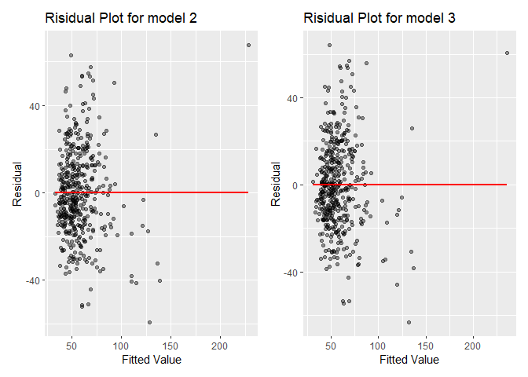

mlr
================
Hao Zheng
12/12/2021

``` r
library(tidyverse)
```

    ## -- Attaching packages --------------------------------------- tidyverse 1.3.1 --

    ## v ggplot2 3.3.5     v purrr   0.3.4
    ## v tibble  3.1.4     v dplyr   1.0.7
    ## v tidyr   1.1.3     v stringr 1.4.0
    ## v readr   2.0.1     v forcats 0.5.1

    ## -- Conflicts ------------------------------------------ tidyverse_conflicts() --
    ## x dplyr::filter() masks stats::filter()
    ## x dplyr::lag()    masks stats::lag()

``` r
library(modelr)
library(patchwork)
# library(GGally)

cdi = read.csv("./data/cdi.csv")
```

### Multiple Linear Regression Model

Next, we try to fit a multiple regression model over the variables, with
the newly created variable crm\_1000 as the outcome.

``` r
# Create a new variable called crm_1000, which is the crime rate per 1000 population in each county in year 1990, and another variable poparea which is the population density per square mile. Also change the number of doctors and beds into doctors and beds per 1000 population.

cdi = 
  cdi %>% 
  mutate(
    # crm_1000 is already generated in Xiao's part
    crm_1000 = crimes/pop * 1000,
    poparea = pop/area,
    docs = docs/pop * 1000,
    beds = beds/pop * 1000,
    region = as.factor(region)
  ) %>% 
  select(-id,-cty,-state,-crimes)
```

From the pairwise plot,

``` r
# Use step-wise regression to try to find an initial mlr model
mult.fit = lm(crm_1000 ~ ., data = cdi)
step(mult.fit, direction = "backward")
```

    ## Start:  AIC=2515.41
    ## crm_1000 ~ area + pop + pop18 + pop65 + docs + beds + hsgrad + 
    ##     bagrad + poverty + unemp + pcincome + totalinc + region + 
    ##     poparea
    ## 
    ##            Df Sum of Sq    RSS    AIC
    ## - pop65     1        11 123801 2513.4
    ## - docs      1        52 123843 2513.6
    ## - area      1        64 123854 2513.6
    ## - unemp     1       220 124010 2514.2
    ## <none>                  123790 2515.4
    ## - bagrad    1      1055 124845 2517.1
    ## - hsgrad    1      1129 124919 2517.4
    ## - pop18     1      2176 125967 2521.1
    ## - beds      1      3770 127560 2526.6
    ## - pcincome  1      7488 131278 2539.2
    ## - poverty   1      8114 131904 2541.3
    ## - totalinc  1     10694 134484 2549.9
    ## - pop       1     12027 135817 2554.2
    ## - poparea   1     24699 148489 2593.5
    ## - region    3     37378 161168 2625.5
    ## 
    ## Step:  AIC=2513.45
    ## crm_1000 ~ area + pop + pop18 + docs + beds + hsgrad + bagrad + 
    ##     poverty + unemp + pcincome + totalinc + region + poparea
    ## 
    ##            Df Sum of Sq    RSS    AIC
    ## - docs      1        51 123853 2511.6
    ## - area      1        69 123871 2511.7
    ## - unemp     1       211 124012 2512.2
    ## <none>                  123801 2513.4
    ## - bagrad    1      1057 124858 2515.2
    ## - hsgrad    1      1143 124945 2515.5
    ## - pop18     1      3134 126935 2522.4
    ## - beds      1      3993 127795 2525.4
    ## - pcincome  1      7618 131419 2537.7
    ## - poverty   1      8607 132408 2541.0
    ## - totalinc  1     10842 134643 2548.4
    ## - pop       1     12180 135981 2552.7
    ## - poparea   1     24841 148642 2591.9
    ## - region    3     37399 161200 2623.6
    ## 
    ## Step:  AIC=2511.63
    ## crm_1000 ~ area + pop + pop18 + beds + hsgrad + bagrad + poverty + 
    ##     unemp + pcincome + totalinc + region + poparea
    ## 
    ##            Df Sum of Sq    RSS    AIC
    ## - area      1        72 123925 2509.9
    ## - unemp     1       207 124060 2510.4
    ## <none>                  123853 2511.6
    ## - hsgrad    1      1188 125041 2513.8
    ## - bagrad    1      1253 125105 2514.1
    ## - pop18     1      3084 126937 2520.4
    ## - beds      1      7105 130957 2534.2
    ## - pcincome  1      7567 131420 2535.7
    ## - poverty   1      8679 132531 2539.4
    ## - totalinc  1     10924 134776 2546.8
    ## - pop       1     12259 136112 2551.2
    ## - poparea   1     24888 148741 2590.2
    ## - region    3     37348 161201 2621.6
    ## 
    ## Step:  AIC=2509.89
    ## crm_1000 ~ pop + pop18 + beds + hsgrad + bagrad + poverty + unemp + 
    ##     pcincome + totalinc + region + poparea
    ## 
    ##            Df Sum of Sq    RSS    AIC
    ## - unemp     1       196 124120 2508.6
    ## <none>                  123925 2509.9
    ## - hsgrad    1      1219 125144 2512.2
    ## - bagrad    1      1253 125178 2512.3
    ## - pop18     1      3072 126996 2518.7
    ## - beds      1      7166 131091 2532.6
    ## - pcincome  1      7507 131431 2533.8
    ## - poverty   1      8630 132554 2537.5
    ## - totalinc  1     11073 134998 2545.6
    ## - pop       1     12545 136470 2550.3
    ## - poparea   1     26974 150899 2594.5
    ## - region    3     37292 161217 2619.6
    ## 
    ## Step:  AIC=2508.58
    ## crm_1000 ~ pop + pop18 + beds + hsgrad + bagrad + poverty + pcincome + 
    ##     totalinc + region + poparea
    ## 
    ##            Df Sum of Sq    RSS    AIC
    ## <none>                  124120 2508.6
    ## - hsgrad    1      1080 125200 2510.4
    ## - bagrad    1      1524 125644 2511.9
    ## - pop18     1      3070 127190 2517.3
    ## - beds      1      7090 131210 2531.0
    ## - pcincome  1      8195 132315 2534.7
    ## - poverty   1     10410 134531 2542.0
    ## - totalinc  1     11238 135358 2544.7
    ## - pop       1     12697 136817 2549.4
    ## - poparea   1     26824 150944 2592.7
    ## - region    3     39000 163120 2622.8

    ## 
    ## Call:
    ## lm(formula = crm_1000 ~ pop + pop18 + beds + hsgrad + bagrad + 
    ##     poverty + pcincome + totalinc + region + poparea, data = cdi)
    ## 
    ## Coefficients:
    ## (Intercept)          pop        pop18         beds       hsgrad       bagrad  
    ##  -9.164e+01    8.049e-05    8.877e-01    2.376e+00    4.860e-01   -6.182e-01  
    ##     poverty     pcincome     totalinc      region2      region3      region4  
    ##   2.065e+00    2.717e-03   -3.646e-03    9.213e+00    2.674e+01    2.052e+01  
    ##     poparea  
    ##   4.240e-03

According the above results of step-wise regression in R, the predicting
model of `crm_1000` contains the continuous predictors `pop`, `pop18`,
`beds`, `hsgrad`, `bagrad`, `poverty`, `pcincome`, `totalinc`, `poparea`
and the categorical predictor `region`.

Then we get the multiple linear regression model for crime rates:

``` r
model1 = lm(crm_1000 ~ pop + pop18 + beds + hsgrad + bagrad + poverty + pcincome + totalinc + poparea + region, data = cdi)

broom::tidy(model1) %>% 
  knitr::kable()
```

| term        |    estimate |  std.error | statistic |   p.value |
|:------------|------------:|-----------:|----------:|----------:|
| (Intercept) | -91.6353305 | 23.7812999 | -3.853251 | 0.0001345 |
| pop         |   0.0000805 |  0.0000122 |  6.609150 | 0.0000000 |
| pop18       |   0.8877337 |  0.2731604 |  3.249862 | 0.0012460 |
| beds        |   2.3758522 |  0.4810686 |  4.938697 | 0.0000011 |
| hsgrad      |   0.4860489 |  0.2522149 |  1.927122 | 0.0546275 |
| bagrad      |  -0.6181563 |  0.2699901 | -2.289552 | 0.0225344 |
| poverty     |   2.0645606 |  0.3449861 |  5.984475 | 0.0000000 |
| pcincome    |   0.0027166 |  0.0005116 |  5.309527 | 0.0000002 |
| totalinc    |  -0.0036463 |  0.0005864 | -6.217787 | 0.0000000 |
| poparea     |   0.0042404 |  0.0004414 |  9.606180 | 0.0000000 |
| region2     |   9.2132247 |  2.5440962 |  3.621414 | 0.0003282 |
| region3     |  26.7390709 |  2.4159770 | 11.067602 | 0.0000000 |
| region4     |  20.5204410 |  2.9390087 |  6.982096 | 0.0000000 |

Now let’s look at the Fitted values and the residuals

``` r
cdi %>% 
  add_predictions(model1) %>% 
  add_residuals(model1) %>% 
  ggplot(aes(x = pred, y = resid)) +
  geom_point(alpha = 0.4) + 
  geom_smooth(se = F, color = "red", method = "lm") +
  labs(title = "Risidual Plot",
       x = "Fitted Value", 
       y = "Residual")
```

    ## `geom_smooth()` using formula 'y ~ x'

<!-- -->

As we can see from the plot, most of the residuals are distributed
symmetrically and around y = 0. However, there are some outliers when
the fitted value is large. But the model is still not very good at
predicting.

In addition, since step-wise regression does not really have a good
reputation, we can try to find other models based on the searching
results of the potentially related factors of crime rates: age, medical
resources, educational level, poverty, unemployment rate, personal
income and population density per square mile.

``` r
model2 = lm(crm_1000 ~ pop18 + beds + hsgrad + poverty + unemp + pcincome + poparea, data = cdi)

broom::tidy(model2) %>% 
  knitr::kable()
```

| term        |    estimate |  std.error | statistic |   p.value |
|:------------|------------:|-----------:|----------:|----------:|
| (Intercept) | -22.6348024 | 20.6352727 | -1.096899 | 0.2732968 |
| pop18       |   0.5136253 |  0.2615950 |  1.963437 | 0.0502364 |
| beds        |   1.3959722 |  0.5617699 |  2.484954 | 0.0133344 |
| hsgrad      |   0.3162693 |  0.2310961 |  1.368562 | 0.1718476 |
| poverty     |   3.1510026 |  0.3572178 |  8.820955 | 0.0000000 |
| unemp       |  -1.1140543 |  0.5478396 | -2.033541 | 0.0426086 |
| pcincome    |   0.0006137 |  0.0003425 |  1.791894 | 0.0738497 |
| poparea     |   0.0046179 |  0.0004994 |  9.247351 | 0.0000000 |

However, the terms `hsgrad` and `pcincome` are not significant, we try
to remove these predictors and fit another mlr model.

``` r
model3 = lm(crm_1000 ~ pop18 + beds + poverty + unemp + poparea, data = cdi)

broom::tidy(model3) %>% 
  knitr::kable()
```

| term        |   estimate | std.error | statistic |   p.value |
|:------------|-----------:|----------:|----------:|----------:|
| (Intercept) | 18.2845448 | 8.7188833 |  2.097120 | 0.0365610 |
| pop18       |  0.5778918 | 0.2495846 |  2.315415 | 0.0210557 |
| beds        |  1.5367150 | 0.5565345 |  2.761221 | 0.0060028 |
| poverty     |  2.5308351 | 0.2653643 |  9.537212 | 0.0000000 |
| unemp       | -1.4474848 | 0.5123305 | -2.825295 | 0.0049416 |
| poparea     |  0.0049101 | 0.0004595 | 10.684856 | 0.0000000 |

Draw the residual plots for model2 and model3:

``` r
res2 = 
  cdi %>% 
  add_predictions(model2) %>% 
  add_residuals(model2) %>% 
  ggplot(aes(x = pred, y = resid)) +
  geom_point(alpha = 0.4) + 
  geom_smooth(se = F, color = "red", method = "lm") +
  labs(title = "Risidual Plot for model 2",
       x = "Fitted Value", 
       y = "Residual")

res3 = 
  cdi %>% 
  add_predictions(model3) %>% 
  add_residuals(model3) %>% 
  ggplot(aes(x = pred, y = resid)) +
  geom_point(alpha = 0.4) + 
  geom_smooth(se = F, color = "red", method = "lm") +
  labs(title = "Risidual Plot for model 3",
       x = "Fitted Value", 
       y = "Residual")

res2 + res3
```

    ## `geom_smooth()` using formula 'y ~ x'
    ## `geom_smooth()` using formula 'y ~ x'

<!-- -->

By the residual plot for the above two models, we cannot see a big
difference.

So we try to compare the three models by ploting their RMSE values.

``` r
cv = crossv_mc(cdi, 100) %>% 
    mutate(
    train = map(train, as_tibble),
    test = map(test, as_tibble)
  ) %>% 
  mutate(
    model_1 = map(train, ~lm(crm_1000 ~ pop + pop18 + beds + hsgrad + bagrad + poverty + pcincome + totalinc + poparea + region, data = cdi)),
    model_2 = map(train, ~lm(crm_1000 ~ pop18 + beds + hsgrad + poverty + unemp + pcincome + poparea, data = cdi)),
    model_3 = map(train, ~lm(crm_1000 ~ pop18 + beds + poverty + unemp + poparea, data = cdi))) %>% 
  mutate(
    rmse_model1 = map2_dbl(model_1, test, ~rmse(model = .x, data = .y)),
    rmse_model2 = map2_dbl(model_2, test, ~rmse(model = .x, data = .y)),
    rmse_model3 = map2_dbl(model_3, test, ~rmse(model = .x, data = .y))
    )

cv %>% 
  select(starts_with("rmse")) %>% 
  pivot_longer(
    everything(),
    names_to = "model",
    values_to = "rmse",
    names_prefix = "rmse_" 
  ) %>% 
  ggplot(aes(x = model, y = rmse)) +  geom_violin(fill = "orange",alpha = 0.4) +
  geom_boxplot(alpha = 0.5, color = "red") 
```

<!-- -->

The model1, which is the initial step-wise regression model is more
optimal than the other two models.
